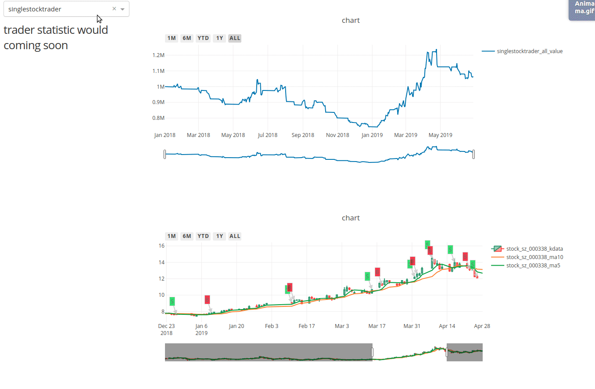

[](https://pypi.org/project/zvt/)
[](https://pypi.org/project/zvt/)
[](https://pypi.org/project/zvt/)
[](https://travis-ci.org/zvtvz/zvt)
[](https://codecov.io/github/zvtvz/zvt)
[](http://hits.dwyl.io/zvtvz/zvt)

**Read this in other languages: [English](README-en.md).**  

ZVT是在[fooltrader](https://github.com/foolcage/fooltrader)的基础上重新思考后编写的量化项目，其包含可扩展的数据recorder，api，因子计算，选股，回测，定位为日线级别全市场分析和交易框架。

# 使用方式
```
pip install -U zvt
```

# 使用展示
[*参考代码*](./zvt/trader/examples)  
### 单标的回测 ###

#### 股票单标的单factor(cross ma) ####
```
class SingleStockTrader(StockTrader):
    def __init__(self,
                 security: str = 'stock_sz_000338',
                 start_timestamp: Union[str, pd.Timestamp] = '2005-01-01',
                 end_timestamp: Union[str, pd.Timestamp] = '2019-06-30',
                 provider: Union[str, Provider] = 'joinquant',
                 level: Union[str, TradingLevel] = TradingLevel.LEVEL_1DAY,
                 trader_name: str = None,
                 real_time: bool = False,
                 kdata_use_begin_time: bool = True) -> None:
        super().__init__([security], SecurityType.stock, None, None, start_timestamp, end_timestamp, provider,
                         level, trader_name, real_time, kdata_use_begin_time=kdata_use_begin_time)

    def init_selectors(self, security_list, security_type, exchanges, codes, start_timestamp, end_timestamp):
        self.selectors = []

        technical_selector = TechnicalSelector(security_list=security_list, security_type=security_type,
                                               exchanges=exchanges, codes=codes,
                                               start_timestamp=start_timestamp,
                                               end_timestamp=end_timestamp, level=TradingLevel.LEVEL_1DAY,
                                               provider='joinquant')
        technical_selector.run()

        self.selectors.append(technical_selector)
```
<p align="center"></p>

#### 股票多单标的单factor(macd) ####
```
class MultipleStockTrader(StockTrader):
    def __init__(self,
                 security_list: List[str] = None,
                 exchanges: List[str] = ['sh', 'sz'],
                 codes: List[str] = None,
                 start_timestamp: Union[str, pd.Timestamp] = None,
                 end_timestamp: Union[str, pd.Timestamp] = None,
                 provider: Union[str, Provider] = 'joinquant',
                 level: Union[str, TradingLevel] = TradingLevel.LEVEL_1DAY,
                 trader_name: str = None,
                 real_time: bool = False,
                 kdata_use_begin_time: bool = False) -> None:
        super().__init__(security_list, SecurityType.stock, exchanges, codes, start_timestamp, end_timestamp, provider,
                         level, trader_name, real_time, kdata_use_begin_time)

    def init_selectors(self, security_list, security_type, exchanges, codes, start_timestamp, end_timestamp):
        my_selector = TargetSelector(security_list=security_list, security_type=security_type, exchanges=exchanges,
                                     codes=codes, start_timestamp=start_timestamp,
                                     end_timestamp=end_timestamp)
        # add the factors
        my_selector \
            .add_filter_factor(BullFactor(security_list=security_list,
                                          security_type=security_type,
                                          exchanges=exchanges,
                                          codes=codes,
                                          start_timestamp=start_timestamp,
                                          end_timestamp=end_timestamp,
                                          level=TradingLevel.LEVEL_1DAY))
        self.selectors.append(my_selector)
```
<p align="center"></p>


# 联系方式  
QQ群:300911873  加群请备注github用户名