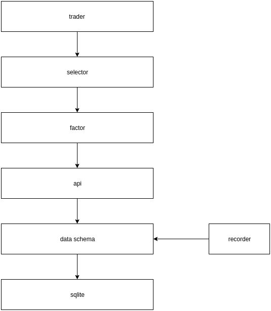

[](https://pypi.org/project/zvt/)
[](https://pypi.org/project/zvt/)
[](https://pypi.org/project/zvt/)
[](https://travis-ci.org/zvtvz/zvt)
[](https://codecov.io/github/zvtvz/zvt)
[](http://hits.dwyl.io/zvtvz/zvt)

**Read this in other languages: [English](README-en.md).**  

ZVT是在[fooltrader](https://github.com/foolcage/fooltrader)的基础上重新思考后编写的量化项目，其包含可扩展的数据recorder，api，因子计算，选股，回测，定位为日线级别全市场分析和交易框架。

# 1.数据
设计要点

* schema的稳定性  
整个金融市场的属性是稳定的，你需要关注的东西是稳定的，比如k线，比如财务报表，比如资金流.
* schema字段的确定性  
举个栗子，资产负债表里面无形资产字段，joinquant为intangible_assets，eastmoney为Intangibleasset，如果你直接依赖provider提供的字段来进行后续的计算，将有极大的风险，一家provider不可用，将使整个程序不可用。因此必须将相应的provider的数据转为自己定义的格式。
* 多provider支持  
前面的两个稳定性决定了多provider支持的可行，并为数据的完整性提供了保障，当某家provider数据不能满足需求时，可以多provider互补。当然，还可以利用多provider对数据进行交叉验证。

扩展数据请参考：[通过添加聚宽数据说明如何做数据扩展](./docs/add_provider.md)

目前支持的数据:

|名称|dataschema|provider|comments|
|-----------|--------|--------|-----|
|个股资料|Stock|eastmoney|个股和板块为多对多的关系|
|板块资料|Index|eastmoney,sina|板块有行业,概念,区域三个分类的维度,不同的provider分类会有所不同,个股和板块为多对多的关系|
|个股日线行情|StockDayKdata|eastmoney,joinquant,netease,sina||
|指数日线行情|IndexDayKdata|eastmoney,sina|指数本质上也是一种板块,指数对应板块资料中的标的|
|个股资金流|MoneyFlow|eastmoney,sina||
|板块资金流|MoneyFlow|eastmoney,sina|对应板块资料里面的标的|
|分红融资数据|DividendFinancing|eastmoney|企业最后的底线就是能不能给投资者赚钱,此为年度统计信息|
|分红明细|DividendDetail|eastmoney||
|融资明细|SPODetail|eastmoney||
|配股明细|RightsIssueDetail|eastmoney||
|主要财务指标|FinanceFactor|eastmoney||
|资产负债表|BalanceSheet|eastmoney||
|利润表|IncomeStatement|eastmoney||
|现金流量表|CashFlowStatement|eastmoney||
|十大股东|TopTenHolder|eastmoney||
|十大流通股东|TopTenTradableHolder|eastmoney||
|机构持股|InstitutionalInvestorHolder|eastmoney||
|高管交易|ManagerTrading|eastmoney||
|大股东交易|HolderTrading|eastmoney||
|大宗交易|BigDealTrading|eastmoney||
|融资融券|MarginTrading|eastmoney||
|龙虎榜数据|DragonAndTiger|eastmoney||

# 2. api
整个api体系提供统一的查询能力，基本上不需要文档，会使用一个，其他也就会使用了。
下面展示几个例子：
### 社保持仓 ###
```bash
In [20]: df = get_top_ten_tradable_holder(start_timestamp='2018-09-30',filters=[TopTenTradableHolder.holder_name.like('%社保%')],order=TopTenTradableHolder.shareholding_ratio.desc())
Out[21]: 
              holder_name    code  shareholding_numbers  shareholding_ratio      change  change_ratio
0             全国社保基金一零三组合  600511            20000000.0              0.0720   5000000.0        0.3333
1             全国社保基金一零三组合  002061            39990000.0              0.0715 -15000000.0       -0.2728
2             全国社保基金六零四组合  002539         
3             全国社保基金六零四组合  002539            38600000.0              0.0637         NaN           NaN

779           全国社保基金一一三组合  601088             9258000.0              0.0005         NaN           NaN
780           全国社保基金四零七组合  601628            10950000.0              0.0004   1500000.0        0.1587
781           全国社保基金四零七组合  601628             9450000.0              0.0003         NaN           NaN

[782 rows x 6 columns]
```
### 马云持仓 ###
```bash
In [26]: df = get_top_ten_tradable_holder(filters=[TopTenTradableHolder.holder_name=='马云'])
Out[27]: 
   holder_name    code  shareholding_numbers  shareholding_ratio      change  change_ratio
0           马云  002204              460800.0              0.0085         NaN           NaN
1           马云  300027             3912000.0              0.0205         NaN           NaN
2           马云  300027             8319000.0              0.0230         NaN           NaN
3           马云  300027             8319000.0              0.0230         NaN           NaN

22          马云  300027            99780000.0              0.0520         NaN           NaN
23          马云  300027            99780000.0              0.0520         NaN           NaN
24          马云  300027            99780000.0              0.0451         NaN           NaN
```
### 2018年报eps前50
```bash
In [30]: df = get_finance_factor(start_timestamp='2018-12-31',order=FinanceFactor.basic_eps.desc(),limit=50,columns=[FinanceFactor.code,FinanceFactor.timestamp,FinanceFactor.basic_eps])
Out[31]: 
      code  timestamp  basic_eps
0   600519 2018-12-31    28.0200
1   603444 2018-12-31    10.1200
2   601318 2018-12-31     6.0200
3   000661 2018-12-31     5.9200

47  603393 2018-12-31     2.0900
48  601869 2018-12-31     2.0900
49  600507 2018-12-31     2.0800

```
更多api和相应的数据，可查看代码:  
[*data schema*](./zvt/domain/)  
[*data api*](./zvt/api/)  
# 3. factor
factor分为两类，过滤器和评分器  
[*MustFactor*](./zvt/factors/factor.py#L120)  
[*ScoreFactor*](./zvt/factors/factor.py#L129)  

### 在一年内有被主人抛弃的个股
```bash
In [39]: factor = ManagerGiveUpFactor(the_timestamp='2018-12-31', window=pd.DateOffset(days=365)) 
In [40]: factor.run()
In [41]: factor.df
Out[41]: 
                                  volume  score
security_id     timestamp                      
stock_sh_600031 2018-12-31 -2.618000e+05  False
                2018-12-31 -2.209000e+05  False
                2018-12-31 -2.067667e+05  False
stock_sh_600089 2018-12-31 -2.226000e+03  False
stock_sh_600136 2018-12-31 -7.510333e+06  False
                2018-12-31 -6.791000e+06  False

stock_sz_300635 2018-12-31 -3.922000e+06  False
                2018-12-31 -2.020000e+06  False
stock_sz_300637 2018-12-31 -5.670000e+04  False
                2018-12-31 -5.670000e+04  False
                2018-12-31 -4.723667e+04  False
                2018-12-31 -4.133500e+04  False
                2018-12-31 -4.440800e+04  False
                2018-12-31 -3.937333e+04  False
                2018-12-31 -4.184857e+04  False
stock_sz_300699 2018-12-31 -1.506000e+04  False
                2018-12-31 -3.238000e+04  False
                2018-12-31 -2.784333e+04  False
                2018-12-31 -5.105750e+04  False
                2018-12-31 -4.494400e+04  False
                2018-12-31 -3.756417e+04  False
                2018-12-31 -3.234029e+04  False
                2018-12-31 -3.085900e+04  False

[318 rows x 2 columns]

```
### 营收利润增速评分
```bash
In [42]: from zvt.factors.finance_factor import *
In [43]: factor = FinanceGrowthFactor(window=pd.DateOffset(days=365), start_timestamp='2017-12-31',end_timestamp='2018-12-31')
In [43]: factor.run() 
In [44]: factor.df
Out[44]: 
                            op_income_growth_yoy  net_profit_growth_yoy
security_id     timestamp                                              
stock_sh_600000 2017-12-31                   NaN                    0.3
                2018-03-31                   NaN                    0.3
                2018-06-30                   NaN                    0.3
                2018-09-30                   NaN                    0.3
                2018-12-31                   NaN                    0.3
stock_sh_600004 2017-12-31                   0.3                    0.3
                2018-03-31                   NaN                    0.3
                2018-06-30                   0.3                    0.3
                2018-09-30                   0.3                    0.3
stock_sh_600006 2017-12-31                   0.3                    NaN
                2018-03-31                   NaN                    NaN
                2018-06-30                   0.0                    0.5
                2018-09-30                   0.0                    0.7
                2018-12-31                   0.0                    0.9
...                                          ...                    ...
stock_sz_300763 2017-12-31                   0.9                    0.9
                2018-12-31                   NaN                    0.3
stock_sz_300765 2017-12-31                   0.3                    NaN
                2018-06-30                   0.3                    0.3
                2018-12-31                   0.5                    0.3
stock_sz_300766 2017-12-31                   0.9                    0.9
                2018-12-31                   0.9                    0.7

[16116 rows x 2 columns]

```
# 4. selector
selector不过是各种factor的组合和权重的调整
# 5. trader
trader不过是selector在时间轴上的应用,然后看其表现
# 6. 如何贡献代码

## 6.1 架构图
<p align="center"></p>

## 6.2 贡献方式

* 测试代码
* bug fix
* 数据源recorder实现
* score factor算法
* trader
* UI
* 文档教程

# 联系方式  
QQ群:300911873  
如果你喜欢该项目,请加星支持一下,并在申请入群时告知github user name.  
