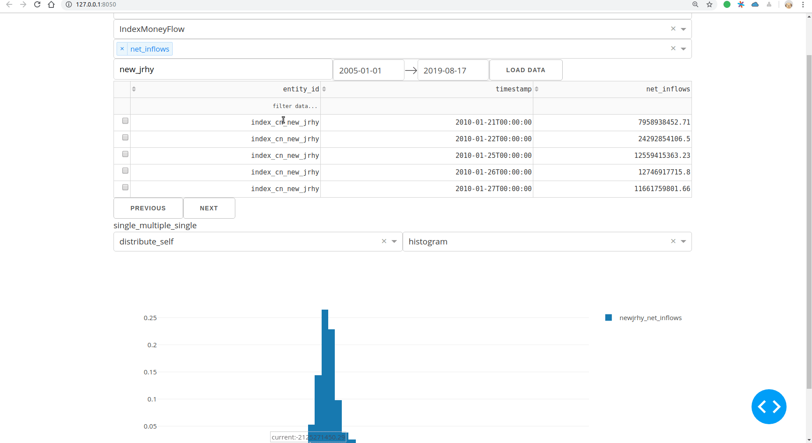
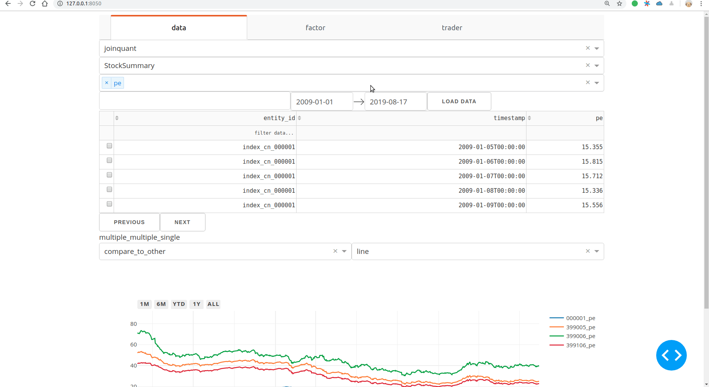
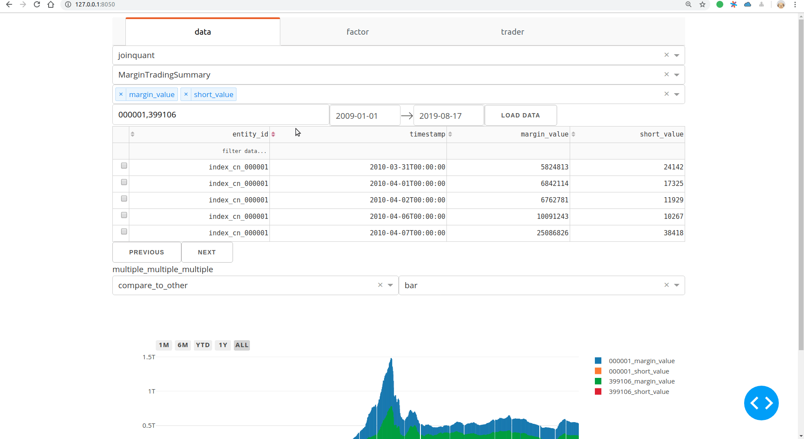
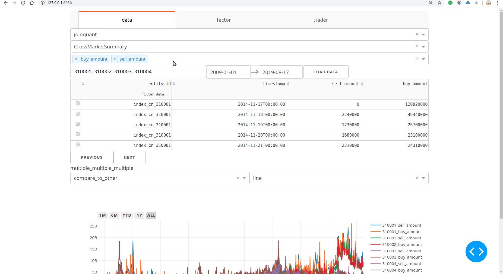
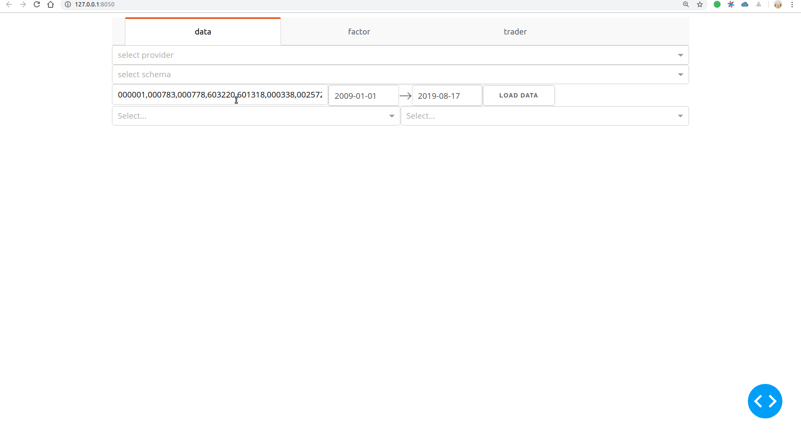
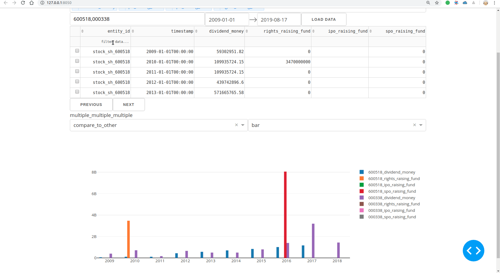
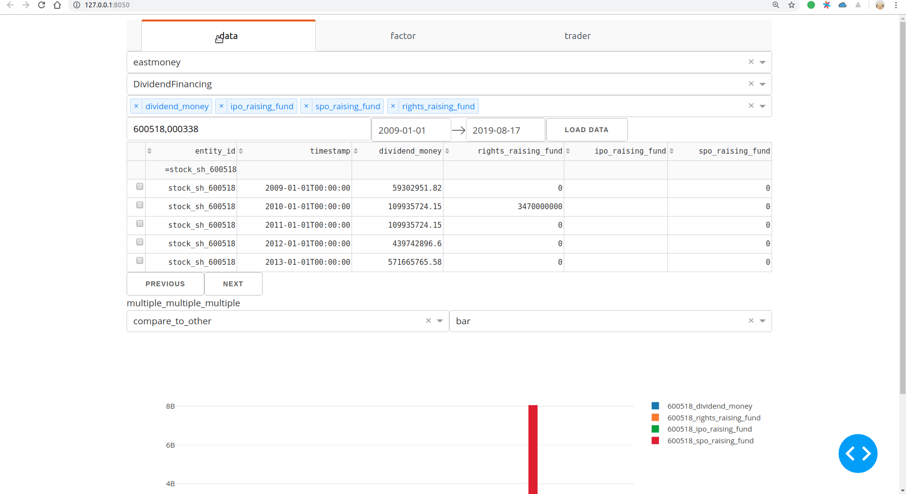
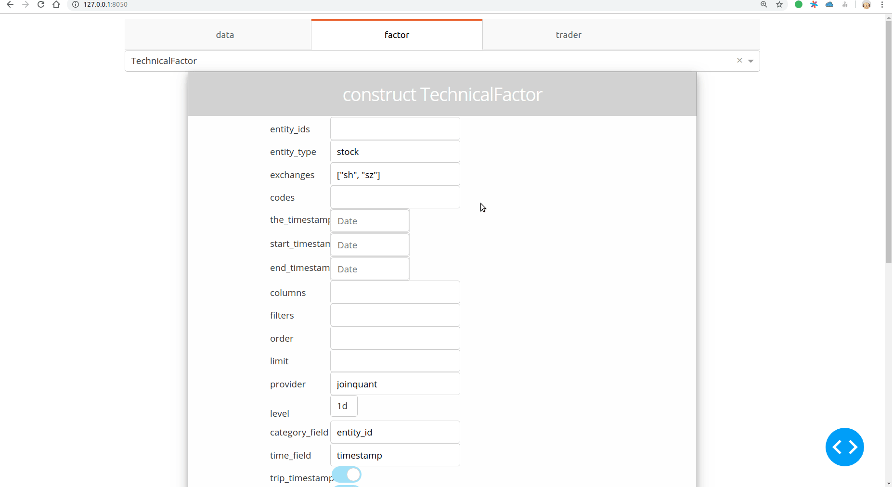

[](https://pypi.org/project/zvt/)
[](https://pypi.org/project/zvt/)
[](https://pypi.org/project/zvt/)
[](https://travis-ci.org/zvtvz/zvt)
[](https://codecov.io/github/zvtvz/zvt)
[](https://pepy.tech/project/zvt)

**Read this in other languages: [English](README-en.md).**  

ZVT is a quant trading platform written after rethinking trading based on [fooltrader](https://github.com/foolcage/fooltrader), 
which includes scalable data recorder, api, factor calculation, stock picking, backtesting, and unified visualization layer,
focus on  **low frequency**, **multi-level**, **multi-targets** full market analysis and trading framework.

##  🔖 Useage examples

### Sector fund flow analysis
<p align="center"></p>

### Market history pe distribution
<p align="center"></p>

### Multi-market pe comparison
<p align="center"></p>

### Margin financing trend
<p align="center"></p>

### Foreign capital flow (Shanghai / Shenzhen-Hong Kong Stock Connect)
<p align="center"></p>

### Dividend comparison
<p align="center"></p>

### Dividend financing comparison
<p align="center"></p>

### Balance sheet analysis
<p align="center"></p>

### Custom factor
<p align="center"></p>


## examples
[*code examples*](./zvt/trader/examples)  
### Algorithmic trading signals and performance
<p align="center"></p>

### Multi-targets transaction
<p align="center"></p>

### real time digital currency trading
<p align="center"></p>

### stock picker
<p align="center"></p>

<p align="center"></p>

The entire framework is highly scalable, and only needs to write very little code to expand each module. The extended tutorials for each module are to be improved, and waiting for your contribution.


##  ✨ Features

- **Enrich comprehensive out-of-the-box and updatable data**
    - china market data: stock meta, financial statements, major shareholder behavior, executive transactions, dividend financing details, stock market capital flow, margin financing, dragon and tiger charts, etc.
    - Market pe, pb, capital flow, margin financing, foreign investment trends, etc.
    - crypto currency data
- Standardization of data, multi-data source (provider) cross-validation, completion
- **Simple and extensible data framework**
- **Uniform and simple API, support sql query, support pandas**
- Scalable factor, abstracting a unified calculation for single- and multi-targets operations
- Provides a unified way of visualizing the factor
- **Concise and unified visual analysis method**
- Support multi-targets, multi-factor, multi-level backtesting
- Real-time visualization of factors, trading signals and strategies
- Support a variety of real trading (implementation)

##  🔰 install

### quick start
#### 1.clone

```
git clone https://github.com/zvtvz/zvt.git
```

setup virtual env(python>=3.6),install requirements
```
pip3 install -r requirements.txt
```

#### 2.import the project(pycharm is good for it,vscode is ok too)

unzip data sample for the tests
```
python3 init_data_sample.py

pytest tests
```

#### 3.download the data and run
change DATA_PATH（default datasample is just for testing）
```
DATA_PATH = os.path.abspath(os.path.join(os.path.dirname(__file__), '..', 'data'))
```

eastmoney: https://pan.baidu.com/s/1CMAlCRYwlhGVxS6drYUEgA 提取码: q2qn  
netease: https://pan.baidu.com/s/1kMhEVO0kH_Pn6wXKyqvJEA 提取码: ijxg  
sina: https://pan.baidu.com/s/1eusW65sdK_WE4icnt8JS1g 提取码: uux3  
joinquant: https://pan.baidu.com/s/1ijrgjUd1WkRMONrwRQU-4w 提取码: dipd  

unzip them to DATA_PATH

run the main entry app
```
python3 index.py
```

for updating the data,please refer to [recorders](./zvt/recorders)

## detailed documentation
  
[http://zvt.foolcage.com](http://zvt.foolcage.com)  
[https://zvtvz.github.io/zvt](https://zvtvz.github.io/zvt)
> docs is waiting for your contribution,especially english docs

## 💌 buy me a cup of coffee

If you think the project is helpful to you, you can buy me a cup of coffee
　　　　　


## 💡 contribution

Looking forward to more developers participating in the development of zvt, I will promise Reivew PR as soon as possible and respond promptly. But submit PR please make sure

1. Pass all unit tests, if it is new, please add unit test to it
2. Compliance with development specifications
3. Update the corresponding document if needed

Developers are also welcome to provide more examples for zvt to complement the documentation, located at [zvt/docs] (https://github.com/zvtvz/zvt/docs)


## Contact information
QQ group:300911873  
check http://www.imqq.com/html/FAQ_en/html/Discussions_3.html


wechat Public number (some tutorials would be here):  


## Thanks
<p><a href=https://www.jetbrains.com/?from=zvt></a></p>
