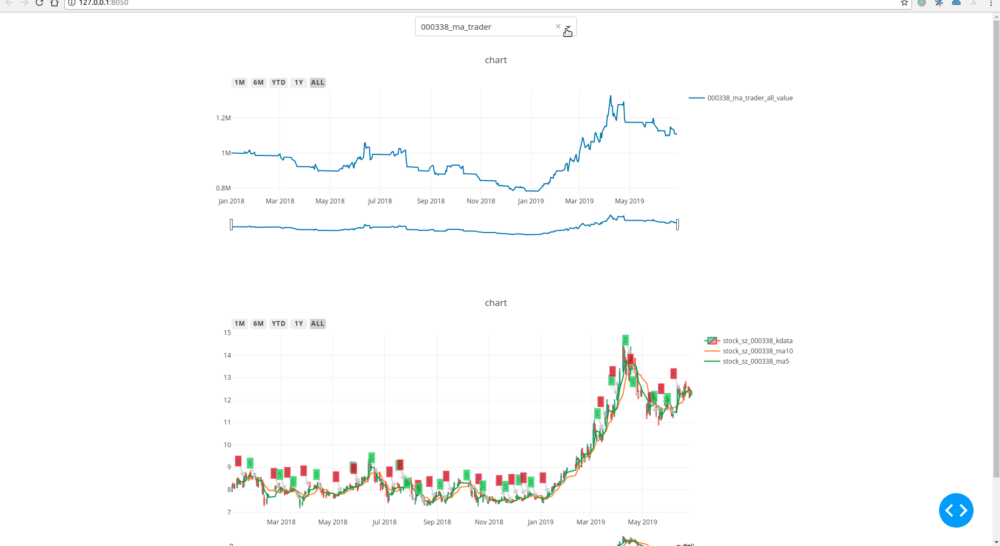
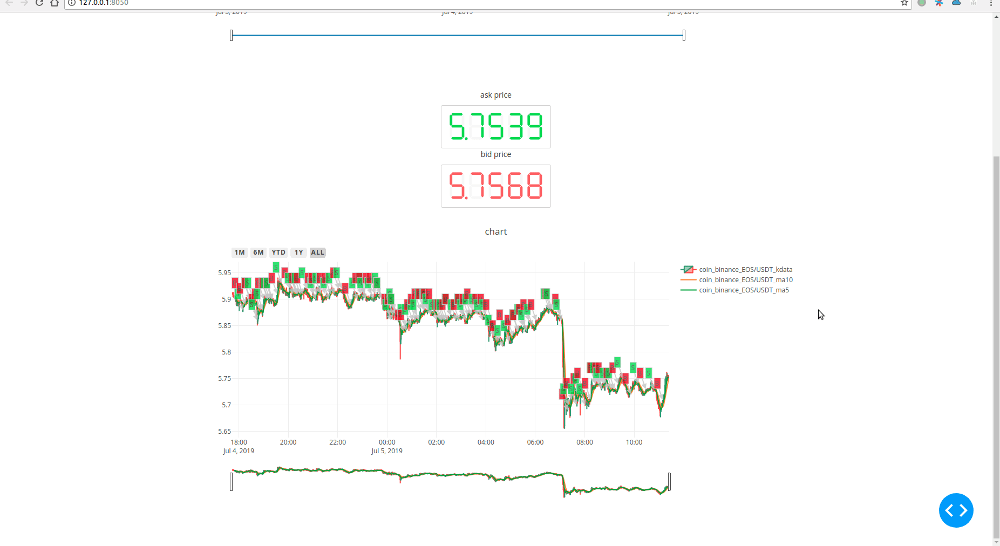
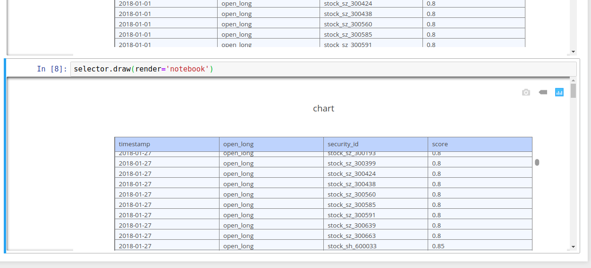
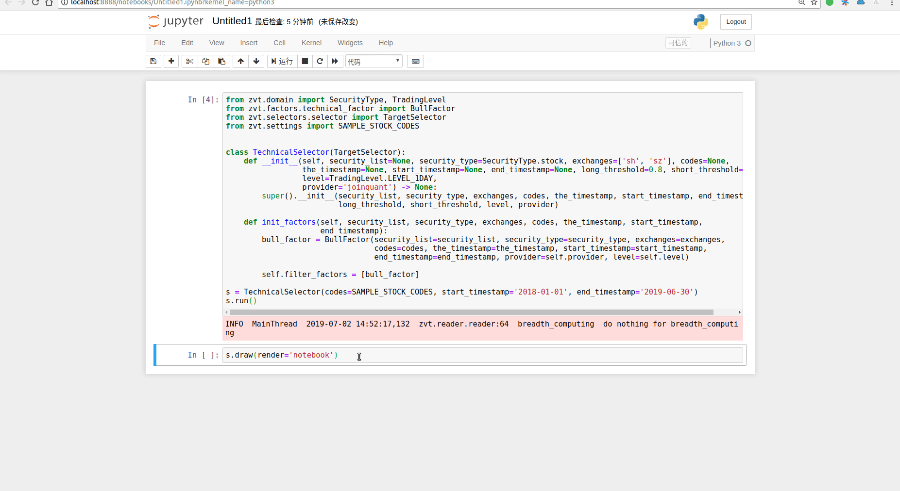

**Read this in other languages: [中文](README-cn.md).**  

ZVT is a quant trading platform written after rethinking about [fooltrader](https://github.com/foolcage/fooltrader), which includes scalable data recorder, api, factor calculation, stock picking, backtesting, trading and focus on  **low frequency**, **multi-level**, **multi-factors** **multi-targets** full market analysis and trading framework.

# how to use
please check the the docs(the two'are same):  
[http://zvt.foolcage.com](http://zvt.foolcage.com)  
[https://zvtvz.github.io/zvt](https://zvtvz.github.io/zvt)

# examples

[*trader examples*](./examples)  

### show your algorithm trading signals and performance

### multiple targets trading

### realtime trading for cryptocurrency

### select the targets for your factors

You could easily extend the factors and use it trading your  targets,ZVT is:

 - **multi-level**
 - **multi-factors** 
 - **multi-targets**

And what's most important:
 - **scaleable**
 - **testable**
 - **viewable**

# Contact information
QQ group:300911873  
if you like this project,please star it and tell me your github user name when joining the qq group  
check http://www.imqq.com/html/FAQ_en/html/Discussions_3.html
