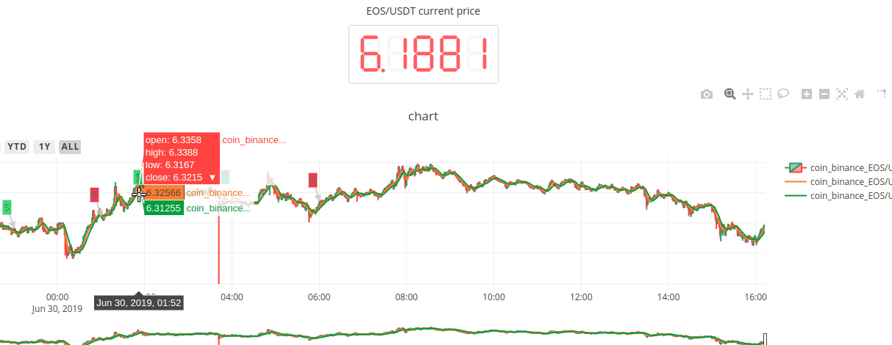

[](https://pypi.org/project/zvt/)
[](https://pypi.org/project/zvt/)
[](https://pypi.org/project/zvt/)
[](https://travis-ci.org/zvtvz/zvt)
[](https://codecov.io/github/zvtvz/zvt)
[](http://hits.dwyl.io/zvtvz/zvt)

**Read this in other languages: [English](README-en.md).**  

ZVT是在[fooltrader](https://github.com/foolcage/fooltrader)的基础上重新思考后编写的量化项目，其包含可扩展的数据recorder，api，因子计算，选股，回测，定位为**中低频** **多级别** **多标的** 全市场分析和交易框架。

# 使用方式
```
pip install -U zvt
```

# 使用展示
[*参考代码*](./zvt/trader/examples)  
### 单标的单factor(cross ma) ###

<p align="center"></p>

#### 多单标的单factor(macd) ####

<p align="center"></p>

#### 1分钟级别实时交易信号 ####
<p align="center"></p>

# 联系方式  
QQ群:300911873  加群请备注github用户名