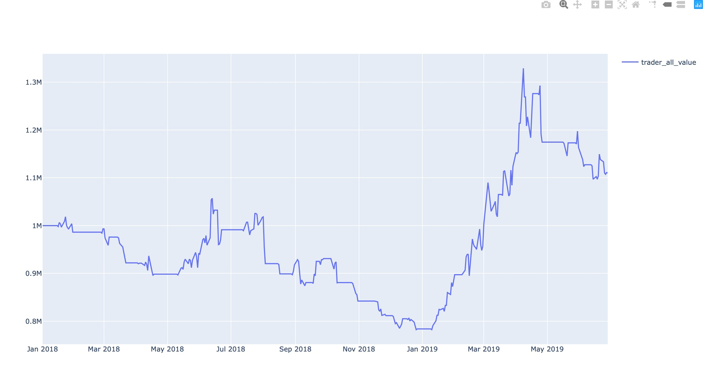
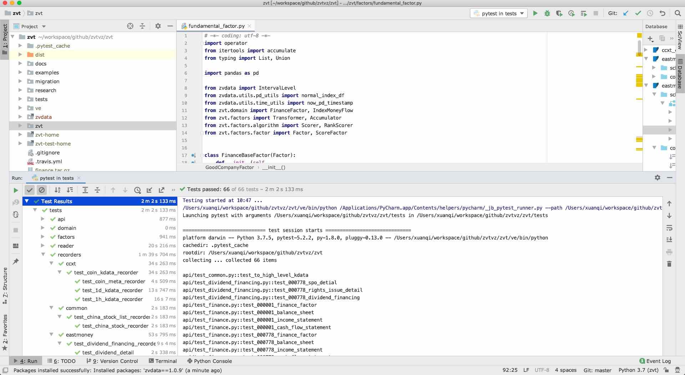
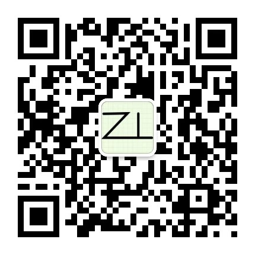

[](https://github.com/zvtvz/zvt)
[](https://pypi.org/project/zvt/)
[](https://pypi.org/project/zvt/)
[](https://pypi.org/project/zvt/)
[](https://travis-ci.org/zvtvz/zvt)
[](https://codecov.io/github/zvtvz/zvt)
[](http://hits.dwyl.io/zvtvz/zvt)

**Read this in other languages: [English](./docs/README-en.md).**  

ZVT是在[fooltrader](https://github.com/foolcage/fooltrader)的基础上重新思考后编写的量化项目，其包含可扩展的数据recorder，api，因子计算，选股，回测，交易,以及统一的可视化，定位为**中低频** **多级别** **多因子** **多标的** 全市场分析和交易框架。

相比其他的量化系统，其不依赖任何中间件，**非常轻，可测试，可推断，可扩展**，尽可能避免复杂晦涩的技术，坚持用简洁的代码表达市场的逻辑。

## 详细文档
文档地址(两个是一样的,只是为了方便有些不方便访问github的同学)  
[http://zvt.foolcage.com](http://zvt.foolcage.com)  
[https://zvtvz.github.io/zvt](https://zvtvz.github.io/zvt)

##  1. 🔖5分钟用起来

>一个系统，如果5分钟用不起来，那肯定是设计软件的人本身就没想清楚，并且其压根就没打算自己用。

### 1.1 安装

假设你已经在>=python3.6的环境中(建议新建一个干净的virtual env环境)
```
pip3 install zvt -i http://pypi.douban.com/simple --trusted-host pypi.douban.com

pip3 show zvt
```

如果不是最新版本
```
pip install --upgrade zvt  -i http://pypi.douban.com/simple --trusted-host pypi.douban.com
```

> 请根据需要决定是否使用豆瓣镜像源


###  1.2 进入ipython,体验一把
```
In [1]: import os

#这一句会进入测试环境，使用自带的测试数据
In [2]: os.environ["TESTING_ZVT"] = "1"

In [3]: from zvt import *
{'data_path': '/Users/xuanqi/zvt-test-home/data',
 'domain_module': 'zvt.domain',
 'email_password': '',
 'email_username': '',
 'http_proxy': '127.0.0.1:1087',
 'https_proxy': '127.0.0.1:1087',
 'jq_password': '',
 'jq_username': '',
 'log_path': '/Users/xuanqi/zvt-test-home/logs',
 'smtp_host': 'smtpdm.aliyun.com',
 'smtp_port': '80',
 'ui_path': '/Users/xuanqi/zvt-test-home/ui',
 'wechat_app_id': '',
 'wechat_app_secrect': '',
 'zvt_home': '/Users/xuanqi/zvt-test-home'}
In [5]: from zvt.api import *

In [6]: df = get_kdata(entity_id='stock_sz_000338',provider='joinquant')

n [8]: df.tail()
Out[8]:
                                    id        entity_id  timestamp   provider    code  name level   open  close   high    low       volume      turnover change_pct turnover_rate
timestamp
2019-10-29  stock_sz_000338_2019-10-29  stock_sz_000338 2019-10-29  joinquant  000338  潍柴动力    1d  12.00  11.78  12.02  11.76   28533132.0  3.381845e+08       None          None
2019-10-30  stock_sz_000338_2019-10-30  stock_sz_000338 2019-10-30  joinquant  000338  潍柴动力    1d  11.74  12.05  12.08  11.61   42652561.0  5.066013e+08       None          None
2019-10-31  stock_sz_000338_2019-10-31  stock_sz_000338 2019-10-31  joinquant  000338  潍柴动力    1d  12.05  11.56  12.08  11.50   77329380.0  9.010439e+08       None          None
2019-11-01  stock_sz_000338_2019-11-01  stock_sz_000338 2019-11-01  joinquant  000338  潍柴动力    1d  11.55  12.69  12.70  11.52  160732771.0  1.974125e+09       None          None
2019-11-04  stock_sz_000338_2019-11-04  stock_sz_000338 2019-11-04  joinquant  000338  潍柴动力    1d  12.77  13.00  13.11  12.77  126673139.0  1.643788e+09       None          None
```

### 1.3 财务数据
```
In [12]: from zvt.domain import *
In [13]: df = get_finance_factor(entity_id='stock_sz_000338',columns=FinanceFactor.important_cols())

In [14]: df.tail()
Out[14]:
            basic_eps  total_op_income    net_profit  op_income_growth_yoy  net_profit_growth_yoy     roe    rota  gross_profit_margin  net_margin  timestamp
timestamp
2018-10-31       0.73     1.182000e+11  6.001000e+09                0.0595                 0.3037  0.1647  0.0414               0.2164      0.0681 2018-10-31
2019-03-26       1.08     1.593000e+11  8.658000e+09                0.0507                 0.2716  0.2273  0.0589               0.2233      0.0730 2019-03-26
2019-04-29       0.33     4.521000e+10  2.591000e+09                0.1530                 0.3499  0.0637  0.0160               0.2166      0.0746 2019-04-29
2019-08-30       0.67     9.086000e+10  5.287000e+09                0.1045                 0.2037  0.1249  0.0315               0.2175      0.0759 2019-08-30
2019-10-31       0.89     1.267000e+11  7.058000e+09                0.0721                 0.1761  0.1720  0.0435               0.2206      0.0736 2019-10-31

```

### 1.4 跑个策略
```
In [15]: from zvt.samples import *
In [16]: t = MyMaTrader(codes=['000338'], level=IntervalLevel.LEVEL_1DAY, start_timestamp='2018-01-01',
   ...:                end_timestamp='2019-06-30', trader_name='000338_ma_trader')
In [17]: t.run()

```
测试数据里面包含的SAMPLE_STOCK_CODES = ['000001', '000783', '000778', '603220', '601318', '000338', '002572', '300027']，试一下传入其任意组合，即可看多标的的效果。

<p align="center"></p>

## 2. 📝正式环境
项目支持多环境切换,默认情况下，不设置环境变量TESTING_ZVT即为正式环境
 ```
In [1]: from zvt import *
{'data_path': '/Users/xuanqi/zvt-home/data',
 'domain_module': 'zvt.domain',
 'email_password': '',
 'email_username': '',
 'http_proxy': '127.0.0.1:1087',
 'https_proxy': '127.0.0.1:1087',
 'jq_password': '',
 'jq_username': '',
 'log_path': '/Users/xuanqi/zvt-home/logs',
 'smtp_host': 'smtpdm.aliyun.com',
 'smtp_port': '80',
 'ui_path': '/Users/xuanqi/zvt-home/ui',
 'wechat_app_id': '',
 'wechat_app_secrect': '',
 'zvt_home': '/Users/xuanqi/zvt-home'}
 ```

>如果你不想使用使用默认的zvt_home目录,请设置环境变量ZVT_HOME再运行。

所有操作跟测试环境是一致的，只是操作的目录不同。

### 2.1 下载历史数据（可选）
东财数据: https://pan.baidu.com/s/1CMAlCRYwlhGVxS6drYUEgA 提取码: q2qn  
资金流，板块数据(新浪): https://pan.baidu.com/s/1eusW65sdK_WE4icnt8JS1g 提取码: uux3  
市场概况，沪/深港通，融资融券数据(聚宽): https://pan.baidu.com/s/1ijrgjUd1WkRMONrwRQU-4w 提取码: dipd  

把下载的数据解压到正式环境的data_path（所有db文件放到该目录下，没有层级结构）

数据的更新是增量的，下载历史数据只是为了节省时间，全部自己更新也是可以的。

### 2.2 注册聚宽(可选)
项目数据支持多provider，在数据schema一致性的基础上，可根据需要进行选择和扩展，目前支持新浪，东财，网易,交易所，ccxt等免费数据。

#### 数据的设计上是让provider来适配schema,而不是反过来，这样即使某provider不可用了，换一个即可，不会影响整个系统的使用。

但免费数据的缺点是显而易见的:不稳定，爬取清洗数据耗时耗力，维护代价巨大，且随时可能不可用。  
个人建议：如果只是学习研究，可以使用免费数据；如果是真正有意投身量化，还是选一家可靠的数据提供商。

项目支持聚宽的数据，可戳以下链接申请使用（目前可免费使用一年）  
https://www.joinquant.com/default/index/sdk?channelId=953cbf5d1b8683f81f0c40c9d4265c0d

> 项目中大部分的免费数据目前都是比较稳定的，且做过严格测试，特别是东财的数据，可放心使用

> 添加其他数据提供商，请参考[数据扩展教程](http://zvt.foolcage.com/#/data_extending)


### 2.3 配置
在zvt_home目录中找到config.json进行配置：

 * jq_username

聚宽数据用户名

 * jq_password

聚宽数据密码

> TODO:其他配置项用法

### 2.4 更新数据

```

In [1]: from zvt.domain import *
In [2]: global_schemas
[zvt.domain.dividend_financing.DividendFinancing,
 zvt.domain.dividend_financing.DividendDetail,
 zvt.domain.dividend_financing.SpoDetail...]
```
整个系统的schema和其对应的recorders采取自注册的方式，global_schemas为系统支持的schema,而其对应的recorder以及如何更新数据，方法如下：
```
In [17]: FinanceFactor.recorders
Out[17]: [zvt.recorders.eastmoney.finance.china_stock_finance_factor_recorder.ChinaStockFinanceFactorRecorder]

In [18]: FinanceFactor.record_data(codes=['000338'])
FinanceFactor registered recorders:[<class 'zvt.recorders.eastmoney.finance.china_stock_finance_factor_recorder.ChinaStockFinanceFactorRecorder'>]
auth success  ( 如需说明文档请查看：https://url.cn/5oB7EOO，更多问题请联系JQData管理员，微信号：JQData02 )
INFO  MainThread  2019-12-15 18:03:35,493  ChinaStockFinanceFactorRecorder:recorder.py:551  evaluate_start_end_size_timestamps  entity_id:stock_sz_000338,timestamps start:2002-12-31 00:00:00,end:2019-09-30 00:00:00
INFO  MainThread  2019-12-15 18:03:35,509  ChinaStockFinanceFactorRecorder:recorder.py:556  evaluate_start_end_size_timestamps  latest record timestamp:2019-10-31 00:00:00
INFO  MainThread  2019-12-15 18:03:35,510  ChinaStockFinanceFactorRecorder:recorder.py:348  run  entity_id:stock_sz_000338,evaluate_start_end_size_timestamps result:None,None,0,None
INFO  MainThread  2019-12-15 18:03:35,510  ChinaStockFinanceFactorRecorder:recorder.py:357  run  finish recording <class 'zvt.domain.finance.FinanceFactor'> for entity_id:stock_sz_000338,latest_timestamp:None
已退出
```
* codes代表需要抓取的股票代码
* 不传入codes则是全市场抓取
* 所有的schema对应的数据更新，方法是一致的

定时任务的方式更新可参考[runners](https://github.com/zvtvz/zvt/blob/master/zvt/recorders/eastmoney/finance0_runner.py)

## 3. 🚀开发

### 3.1 clone代码

```
git clone https://github.com/zvtvz/zvt.git
```

设置项目的virtual env(python>=3.6),安装依赖
```
pip3 install -r requirements.txt
pip3 install pytest
```

### 3.2 测试案例
pycharm导入工程(推荐,你也可以使用其他ide)，然后pytest跑测试案例

<p align="center"></p>

大部分功能使用都可以从tests里面参考

## ✨ 特性
- **丰富全面开箱即用可扩展可持续增量更新的数据**
    - A股数据:行情,财务报表,大股东行为,高管交易,分红融资详情,个股板块资金流向,融资融券,龙虎榜等数据
    - 市场整体pe,pb,资金流，融资融券，外资动向等数据
    - 数字货币数据
- 数据的标准化,多数据源(provider)交叉验证,补全
- **简洁可扩展的数据框架**
- **统一简洁的API,支持sql查询,支持pandas**
- 可扩展的factor,对单标的和多标的的运算抽象了一种统一的计算方式
- **支持多标的,多factor,多级别的回测方式**
- 支持交易信号和策略使用到的factor的实时可视化
- 支持多种实盘交易(实现中)

## 💡贡献

期待能有更多的开发者参与到 zvt 的开发中来，我会保证尽快 Reivew PR 并且及时回复。但提交 PR 请确保

1. 通过所有单元测试，如若是新功能，请为其新增单元测试
2. 遵守开发规范
3. 如若需要，请更新相对应的文档

也非常欢迎开发者能为 zvt 提供更多的示例，共同来完善文档。

## 💌请作者喝杯咖啡

如果你觉得项目对你有帮助,可以请作者喝杯咖啡  
　　　　　


## 🤝联系方式  

QQ群:300911873  

个人微信:foolcage 添加暗号:zvt  


------
微信公众号:  


知乎专栏:  
https://zhuanlan.zhihu.com/automoney