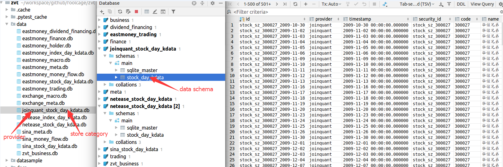
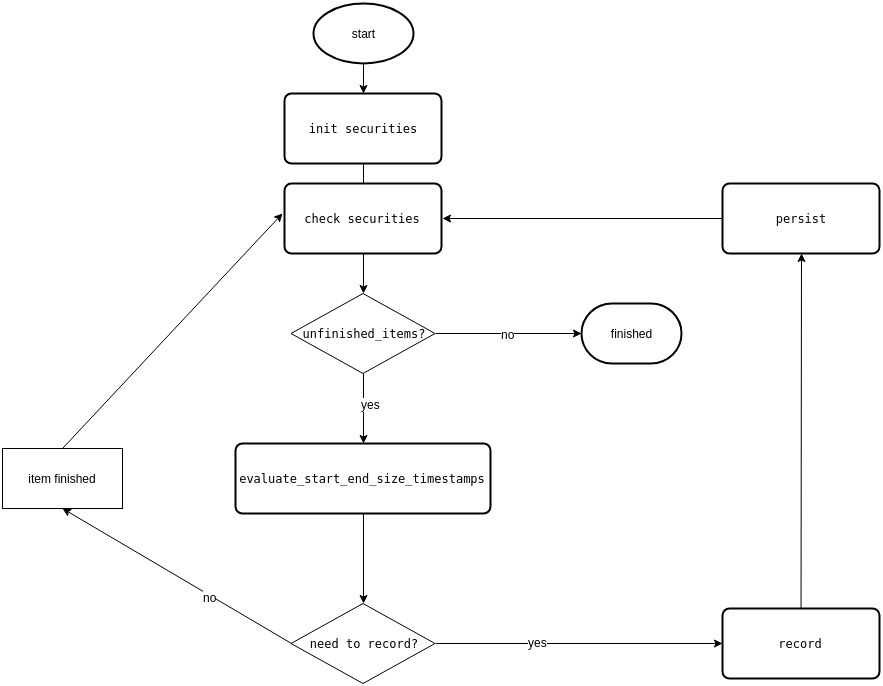

# 1. 数据结构
相关概念及关系
### 1.1 provider
代表数据提供商,比如joinquant,eastmoney,sina,netease
### 1.2 store category
数据的逻辑分类,物理上代表一个db,其下面一般有多个data schema,schema间可能有关系
### 1.3 data schema
数据的结构描述,物理上代表一个table

#### *逻辑视图* ####
<p align="center"></p>

#### *物理视图* ####
<p align="center"></p>

> 一般来说,data schema是稳定的,有些数据需要多个provider来一起生成,这时也认为数据只属于某个provider;某类数据有多个provider时,可以相互验证,api上只需要指定相应的provider即可
# 2. 如何添加provider支持
下面以joinquant来举个栗子

### 2.1 添加joinquant provider ###

[*代码*](https://github.com/zvtvz/zvt/blob/master/zvt/domain/common.py#L33) 

```
class Provider(enum.Enum):
    EASTMONEY = 'eastmoney'
    SINA = 'sina'
    NETEASE = 'netease'
    EXCHANGE = 'exchange'
    JOINQUANT = 'joinquant'
```

### 2.2 添加store category ###
[*代码*](https://github.com/zvtvz/zvt/blob/master/zvt/domain/common.py#L37)  
目前定义的类别,需要扩展的在其基础上添加
```
class StoreCategory(enum.Enum):
    meta = 'meta'
    #个股日线行情数据
    stock_day_kdata = 'stock_day_kdata'
    index_day_kdata = 'index_day_kdata'
    finance = 'finance'
    dividend_financing = 'dividend_financing'
    holder = 'holder'
    trading = 'trading'
    money_flow = 'money_flow'
    macro = 'macro'
    business = 'business'

category_map_db = {
    StoreCategory.meta: MetaBase,
    #个股日线行情数据
    StoreCategory.stock_day_kdata: StockDayKdataBase,
    StoreCategory.index_day_kdata: IndexDayKdataBase,
    StoreCategory.finance: FinanceBase,
    StoreCategory.dividend_financing: DividendFinancingBase,
    StoreCategory.holder: HolderBase,
    StoreCategory.trading: TradingBase,
    StoreCategory.money_flow: MoneyFlowBase,
    StoreCategory.macro: MacroBase,
    StoreCategory.business: BusinessBase,
}

```
### 2.3 添加data schema ###
[*代码*](https://github.com/zvtvz/zvt/blob/master/zvt/domain/quote.py#L7)  
个股日线行情数据结构
```
class StockDayKdata(StockDayKdataBase):
    __tablename__ = 'stock_day_kdata'

    id = Column(String(length=128), primary_key=True)
    provider = Column(String(length=32))
    timestamp = Column(DateTime)
    security_id = Column(String(length=128))
    code = Column(String(length=32))
    name = Column(String(length=32))
    # level = Column(Enum(IntervalLevel, values_callable=enum_value))
    level = Column(String(length=32))

    open = Column(Float)
    hfq_open = Column(Float)
    qfq_open = Column(Float)
    close = Column(Float)
    hfq_close = Column(Float)
    qfq_close = Column(Float)
    high = Column(Float)
    hfq_high = Column(Float)
    qfq_high = Column(Float)
    low = Column(Float)
    hfq_low = Column(Float)
    qfq_low = Column(Float)
    volume = Column(Float)
    turnover = Column(Float)
    change_pct = Column(Float)
    turnover_rate = Column(Float)
    factor = Column(Float)
```
### 2.4 关联provider和相应的store category
[*代码*](https://github.com/zvtvz/zvt/blob/master/zvt/domain/quote.py#L66)  
支持其他数据时,在此扩展
```
provider_map_category = {
    Provider.JOINQUANT:[StoreCategory.stock_day_kdata],
    Provider.JOINQUANT.value:[StoreCategory.stock_day_kdata]
}
```

### 2.5 实现相应的recorder
[*代码*](https://github.com/zvtvz/zvt/blob/master/zvt/recorders/joinquant/jq_china_stock_day_kdata_recorder.py)  
核心代码
```
#将聚宽数据转换为标准zvt数据
class MyApiWrapper(ApiWrapper):
    def request(self, url=None, method='get', param=None, path_fields=None):
        security_item = param['security_item']
        start_timestamp = param['start_timestamp']
        # 不复权
        df = get_price(to_jq_security_id(security_item), start_date=to_time_str(start_timestamp),
                       end_date=now_time_str(),
                       frequency='daily',
                       fields=['open', 'close', 'low', 'high', 'volume', 'money'],
                       skip_paused=True, fq=None)
        df.index.name = 'timestamp'
        df.reset_index(inplace=True)
        df['name'] = security_item.name
        df.rename(columns={'money': 'turnover'}, inplace=True)

        df['timestamp'] = pd.to_datetime(df['timestamp'])
        df['provider'] = Provider.JOINQUANT.value
        df['level'] = param['level']

        return df.to_dict(orient='records')

#补全复权数据
def on_finish(self, security_item):
    kdatas = get_kdata(security_id=security_item.id, level=self.level.value, order=StockDayKdata.timestamp.asc(),
                       return_type='domain',
                       session=self.session,
                       filters=[StockDayKdata.hfq_close.is_(None),
                                StockDayKdata.timestamp >= to_pd_timestamp('2005-01-01')])
    if kdatas:
        start = kdatas[0].timestamp
        end = kdatas[-1].timestamp

        # get hfq from joinquant
        df = get_price(to_jq_security_id(security_item), start_date=to_time_str(start), end_date=now_time_str(),
                       frequency='daily',
                       fields=['factor', 'open', 'close', 'low', 'high'],
                       skip_paused=True, fq='post')
        if df is not None and not df.empty:
            # fill hfq data
            for kdata in kdatas:
                if kdata.timestamp in df.index:
                    kdata.hfq_open = df.loc[kdata.timestamp, 'open']
                    kdata.hfq_close = df.loc[kdata.timestamp, 'close']
                    kdata.hfq_high = df.loc[kdata.timestamp, 'high']
                    kdata.hfq_low = df.loc[kdata.timestamp, 'low']
                    kdata.factor = df.loc[kdata.timestamp, 'factor']
            self.session.commit()

            latest_factor = df.factor[-1]
            # factor not change yet, no need to reset the qfq past
            if latest_factor == self.current_factors.get(security_item.id):
                sql = 'UPDATE stock_day_kdata SET qfq_close=hfq_close/{},qfq_high=hfq_high/{}, qfq_open= hfq_open/{}, qfq_low= hfq_low/{} where ' \
                      'security_id=\'{}\' and level=\'{}\' and (qfq_close isnull or qfq_high isnull or qfq_low isnull or qfq_open isnull)'.format(
                    latest_factor, latest_factor, latest_factor, latest_factor, security_item.id, self.level.value)
            else:
                sql = 'UPDATE stock_day_kdata SET qfq_close=hfq_close/{},qfq_high=hfq_high/{}, qfq_open= hfq_open/{}, qfq_low= hfq_low/{} where ' \
                      'security_id=\'{}\' and level=\'{}\''.format(latest_factor,
                                                                   latest_factor,
                                                                   latest_factor,
                                                                   latest_factor,
                                                                   security_item.id,
                                                                   self.level.value)
            self.logger.info(sql)
            self.session.execute(sql)
            self.session.commit()

    # TODO:use netease provider to get turnover_rate
    self.logger.info('use netease provider to get turnover_rate')
```

这里留了一个练习,由于聚宽的数据没有提供换手率和当日涨跌幅,可以通过其他数据源补全或者自己计算的方式来完成.  

网易的数据没有复权信息,通过聚宽的factor来补全,同理,可以用网易的换手率,涨跌幅数据来补全聚宽数据.
[*参考代码*](https://github.com/zvtvz/zvt/blob/master/zvt/recorders/netease/china_stock_day_kdata_recorder.py)

### 2.6 运行recorder

在[settings](../zvt/settings.py)设置自己的jqdata账户和密码

>jqdata目前免费使用一年,注册地址如下
>https://www.joinquant.com/default/index/sdk?f=home&m=banner

```
if __name__ == '__main__':
    init_process_log('jq_china_stock_day_kdata.log')
    ChinaStockDayKdataRecorder(level=IntervalLevel.LEVEL_1DAY, codes=['300027']).run()
```
这里codes填写需要抓取的标的，如果不设置codes就是全市场抓取。

# 3. 获得的能力
添加一种数据源后,天然就获得相应的api,factor,selector和trader的能力,这里展示使用聚宽的数据的能力
```
In [1]: from zvt.api.technical import * 
In [2]: from zvt.api.domain import * 
In [3]: df1=get_kdata(security_id='stock_sz_300027', provider='joinquant',start_timestamp='2019-01-01',limit=10)
In [4]: df1                                                                     
                           id   provider  timestamp      security_id    code  name level  open  hfq_open  qfq_open  close  hfq_close  qfq_close  high  hfq_high  qfq_high   low  hfq_low   qfq_low      volume      turnover change_pct turnover_rate  factor
0  stock_sz_300027_2019-01-02  joinquant 2019-01-02  stock_sz_300027  300027  华谊兄弟    1d  4.54     68.58  4.539918   4.40      66.47   4.400238  4.58     69.19  4.580299  4.35    65.71  4.349927  29554330.0  1.306117e+08       None          None  15.106
1  stock_sz_300027_2019-01-03  joinquant 2019-01-03  stock_sz_300027  300027  华谊兄弟    1d  4.40     66.47  4.400238   4.42      66.77   4.420098  4.45     67.22  4.449887  4.36    65.86  4.359857  15981569.0  7.052363e+07       None          None  15.106
2  stock_sz_300027_2019-01-04  joinquant 2019-01-04  stock_sz_300027  300027  华谊兄弟    1d  4.36     65.86  4.359857   4.52      68.28   4.520058  4.54     68.58  4.539918  4.33    65.41  4.330068  17103081.0  7.657399e+07       None          None  15.106
3  stock_sz_300027_2019-01-07  joinquant 2019-01-07  stock_sz_300027  300027  华谊兄弟    1d  4.54     68.58  4.539918   4.59      69.34   4.590229  4.63     69.94  4.629948  4.48    67.67  4.479677  16163938.0  7.383168e+07       None          None  15.106
4  stock_sz_300027_2019-01-08  joinquant 2019-01-08  stock_sz_300027  300027  华谊兄弟    1d  4.59     69.34  4.590229   4.60      69.49   4.600159  4.66     70.39  4.659738  4.56    68.88  4.559778  10908603.0  5.034655e+07       None          None  15.106
5  stock_sz_300027_2019-01-09  joinquant 2019-01-09  stock_sz_300027  300027  华谊兄弟    1d  4.63     69.94  4.629948   4.58      69.19   4.580299  4.73     71.45  4.729909  4.58    69.19  4.580299  16901976.0  7.881876e+07       None          None  15.106
6  stock_sz_300027_2019-01-10  joinquant 2019-01-10  stock_sz_300027  300027  华谊兄弟    1d  4.63     69.94  4.629948   4.61      69.64   4.610089  4.76     71.90  4.759698  4.59    69.34  4.590229  20855469.0  9.717176e+07       None          None  15.106
7  stock_sz_300027_2019-01-11  joinquant 2019-01-11  stock_sz_300027  300027  华谊兄弟    1d  4.60     69.49  4.600159   4.67      70.55   4.670330  4.67     70.55  4.670330  4.56    68.88  4.559778  13216260.0  6.089670e+07       None          None  15.106
8  stock_sz_300027_2019-01-14  joinquant 2019-01-14  stock_sz_300027  300027  华谊兄弟    1d  4.63     69.94  4.629948   4.57      69.03   4.569707  4.65     70.24  4.649808  4.55    68.73  4.549848  12421993.0  5.705187e+07       None          None  15.106
9  stock_sz_300027_2019-01-15  joinquant 2019-01-15  stock_sz_300027  300027  华谊兄弟    1d  4.56     68.88  4.559778   4.64      70.09   4.639878  4.66     70.39  4.659738  4.54    68.58  4.539918  14403671.0  6.637258e+07       None          None  15.106

#跟网易的数据比较
In [24]: df2=get_kdata(security_id='stock_sz_300027', provider='netease',start_timestamp='2019-01-01',limit=10)                                                                          

In [25]: df2                                                                                                                                                                             
Out[25]: 
                           id provider  timestamp      security_id    code  name level  open  hfq_open  qfq_open  close  hfq_close  qfq_close  high  hfq_high  qfq_high   low  hfq_low   qfq_low      volume      turnover  change_pct  turnover_rate  factor
0  stock_sz_300027_2019-01-02  netease 2019-01-02  stock_sz_300027  300027  华谊兄弟    1d  4.54     68.58  4.539918   4.40      66.47   4.400238  4.58     69.19  4.580299  4.35    65.71  4.349927  29554330.0  1.306117e+08     -6.1834         1.0652  15.106
1  stock_sz_300027_2019-01-03  netease 2019-01-03  stock_sz_300027  300027  华谊兄弟    1d  4.40     66.47  4.400238   4.42      66.77   4.420098  4.45     67.22  4.449887  4.36    65.86  4.359857  15981569.0  7.052363e+07      0.4545         0.5760  15.106
2  stock_sz_300027_2019-01-04  netease 2019-01-04  stock_sz_300027  300027  华谊兄弟    1d  4.36     65.86  4.359857   4.52      68.28   4.520058  4.54     68.58  4.539918  4.33    65.41  4.330068  17103081.0  7.657399e+07      2.2624         0.6164  15.106
3  stock_sz_300027_2019-01-07  netease 2019-01-07  stock_sz_300027  300027  华谊兄弟    1d  4.54     68.58  4.539918   4.59      69.34   4.590229  4.63     69.94  4.629948  4.48    67.67  4.479677  16163938.0  7.383168e+07      1.5487         0.5826  15.106
4  stock_sz_300027_2019-01-08  netease 2019-01-08  stock_sz_300027  300027  华谊兄弟    1d  4.59     69.34  4.590229   4.60      69.49   4.600159  4.66     70.39  4.659738  4.56    68.88  4.559778  10908603.0  5.034655e+07      0.2179         0.3932  15.106
5  stock_sz_300027_2019-01-09  netease 2019-01-09  stock_sz_300027  300027  华谊兄弟    1d  4.63     69.94  4.629948   4.58      69.19   4.580299  4.73     71.45  4.729909  4.58    69.19  4.580299  16901976.0  7.881876e+07     -0.4348         0.6092  15.106
6  stock_sz_300027_2019-01-10  netease 2019-01-10  stock_sz_300027  300027  华谊兄弟    1d  4.63     69.94  4.629948   4.61      69.64   4.610089  4.76     71.90  4.759698  4.59    69.34  4.590229  20855469.0  9.717176e+07      0.6550         0.7517  15.106
7  stock_sz_300027_2019-01-11  netease 2019-01-11  stock_sz_300027  300027  华谊兄弟    1d  4.60     69.49  4.600159   4.67      70.55   4.670330  4.67     70.55  4.670330  4.56    68.88  4.559778  13216260.0  6.089670e+07      1.3015         0.4763  15.106
8  stock_sz_300027_2019-01-14  netease 2019-01-14  stock_sz_300027  300027  华谊兄弟    1d  4.63     69.94  4.629948   4.57      69.03   4.569707  4.65     70.24  4.649808  4.55    68.73  4.549848  12421993.0  5.705187e+07     -2.1413         0.4477  15.106
9  stock_sz_300027_2019-01-15  netease 2019-01-15  stock_sz_300027  300027  华谊兄弟    1d  4.56     68.88  4.559778   4.64      70.09   4.639878  4.66     70.39  4.659738  4.54    68.58  4.539918  14403671.0  6.637258e+07      1.5317         0.5191  15.106

```
比较两家数据
```
In [26]: df1.loc[:,['open','close','high','low','volume']]-df2.loc[:,['open','close','high','low','volume']]                                                                             
Out[26]: 
   open  close  high  low  volume
0   0.0    0.0   0.0  0.0     0.0
1   0.0    0.0   0.0  0.0     0.0
2   0.0    0.0   0.0  0.0     0.0
3   0.0    0.0   0.0  0.0     0.0
4   0.0    0.0   0.0  0.0     0.0
5   0.0    0.0   0.0  0.0     0.0
6   0.0    0.0   0.0  0.0     0.0
7   0.0    0.0   0.0  0.0     0.0
8   0.0    0.0   0.0  0.0     0.0
9   0.0    0.0   0.0  0.0     0.0
```
嗯,两家的数据是一致的,数据的准确性得到进一步的确认

# 4. recorder原理
将各provider提供(或者自己爬取)的数据**变成**符合data schema的数据需要做好以下几点:  
* 初始化要抓取的标的  
可抓取单标的来调试，然后抓取全量标的
* 能够从上次抓取的地方接着抓  
减少不必要的请求，增量抓取
* 封装常用的请求方式  
对时间序列数据的请求，无非start,end,size,time list的组合
* 能够自动去重
* 能够设置抓取速率
* 提供抓取完成的回调函数  
方便数据校验和多provider数据补全

流程图如下：
<p align="center"></p>

具体实现请查看[*recorder*](../zvt/recorders/recorder.py)，项目一部分的recorder实现以开源的方式直接提供,一部分闭源,只提供最终数据库文件(会发布在dropbox和qq群).  

整个东财的recorder在基础recorder类的基础，基本上一类数据就10行左右代码搞定；掌握了上面的方法，相信大家也很容易其他写出的joinquant recorder。