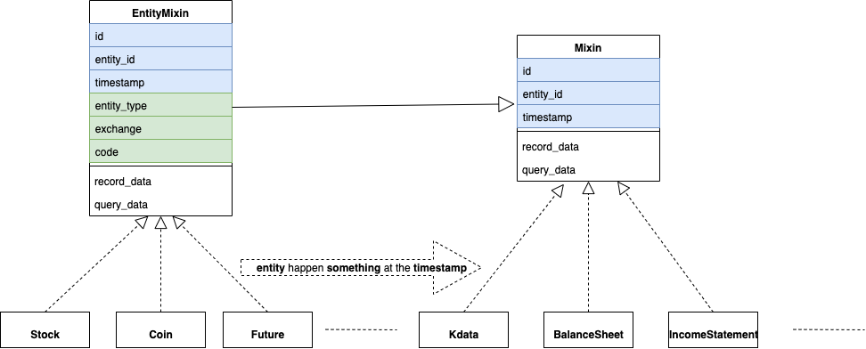

## 1. 数据是什么？

没有数据，量化便成了空中楼阁。

那么，在量化中，数据到底是什么？

zvt对量化数据进行了简洁统一的抽象：数据就是 **投资标的** 在**某时间点(段)** 所**发生的事情**的描述。

其中，投资标的，叫**entity**；时间点(段)，叫**timestamp**；事情的描述根据事情的不同而具有不同的**属性**。

整体结构如下:
<p align="center"></p>

### 1.1 投资标的(entity)

首先，我们得有投资标的。

而在整个市场里，投资标的一定会有三个属性:

* **证券类型(entity_type)**

股票(stock)，债券(bond)，期货(future)，数字货币(coin)，基金(fund)等

* **交易所(exchange)**

上海证券交易所(sh)，深圳证券交易所(sz)等

* **代码(code)**

投资标的编码，A股中的000338,601318,数字货币交易中的BTC/USDT,EOS/USDT等

所以，zvt里面投资标的的唯一编码(entity_id)为:{entity_type}\_{exchange}\_{code}

entity基类定义如下:
```
class EntityMixin(Mixin):
    entity_type = Column(String(length=64))
    exchange = Column(String(length=32))
    code = Column(String(length=64))
    name = Column(String(length=128))
```

### 1.2 投资标的发生的事

而投资标的发生的事，一定会有三个属性：
* **entity_id**

投资标的id

* **timestamp**

发生时间点(段)

* **id**

事件的唯一编码，一般使情况下格式为:{entity_id}_{timestamp}

entity发生的事情定义如下:
```
class Mixin(object):
    id = Column(String, primary_key=True)
    entity_id = Column(String)

    # the meaning could be different for different case,most of time it means 'happen time'
    timestamp = Column(DateTime)
```

>注意，上面EntityMixin继承了Mixin，如何理解？
>entity的诞生其实也是一个事件，这时，timestamp就代表其上市日。

## 2. 数据的稳定性和扩展性
市场没有新鲜事，市场数据更没有新鲜事。

对市场理解越深，就越能定义出稳定的市场数据结构。

而对市场的理解并不是一蹴而就的，这就要求数据结构的设计必须具有可扩展性。

那么,什么是**稳定**并具有**可扩展性**的数据结构？

稳定至少要达到以下的标准:
* **标准的字段**

不管数据来源何处，**确定的语义**在系统里面必须对应**确定的字段**；净资产收益率就叫roe,每股收益就叫eps,毛利率就叫gross_profit_margin。

* **完全分类(正交)**

技术面，基本面，宏观面，消息面等。

* **层次关系**

原始数据和衍生(计算)数据的关系，比如k线数据和各种技术指标；财报和各种财务指标。

而扩展性最重要的就是，**容易添加新数据**，并使得新数据无缝融入到系统中。

数据定义的目录为[domain](https://github.com/zvtvz/zvt/tree/master/zvt/domain)

## 3. 系统都有哪些数据？
```
In [1]: from zvt.domain import *
In [2]: global_schemas
[zvt.domain.dividend_financing.DividendFinancing,
 zvt.domain.dividend_financing.DividendDetail,
 zvt.domain.dividend_financing.SpoDetail...]
```

global_schemas就是系统支持的所有数据，具体含义可以查看相应字段的注释，或者调用相应schema的help方法:
```
In [3]: DividendFinancing.help()
class DividendFinancing(DividendFinancingBase, Mixin):
    __tablename__ = 'dividend_financing'

    provider = Column(String(length=32))
    code = Column(String(length=32))

    # 分红总额
    dividend_money = Column(Float)

    # 新股
    ipo_issues = Column(Float)
    ipo_raising_fund = Column(Float)

    # 增发
    spo_issues = Column(Float)
    spo_raising_fund = Column(Float)
    # 配股
    rights_issues = Column(Float)
    rights_raising_fund = Column(Float)
```

## 4. 如何查询数据？
查询数据，调用schema的query_data方法即可；由于该方法极为重要，有必要对其支持的参数进行详细的说明。

```
    @classmethod
    def query_data(cls,
                   provider_index: int = 0,
                   ids: List[str] = None,
                   entity_ids: List[str] = None,
                   entity_id: str = None,
                   codes: List[str] = None,
                   code: str = None,
                   level: Union[IntervalLevel, str] = None,
                   provider: str = None,
                   columns: List = None,
                   return_type: str = 'df',
                   start_timestamp: Union[pd.Timestamp, str] = None,
                   end_timestamp: Union[pd.Timestamp, str] = None,
                   filters: List = None,
                   session: Session = None,
                   order=None,
                   limit: int = None,
                   index: Union[str, list] = None,
                   time_field: str = 'timestamp'):
```
* provider_index

数据支持多provider,可以通过schema.providers来查看，provider_index为其providers的索引，默认为0

* ids

以id列表为过滤条件

* entity_ids

以entity_id列表为过滤条件

* entity_id

指定entity_id为过滤条件

* codes

以entity的code列表为过滤条件

* code

指定entity的code为过滤条件

* level

级别，对k线数据有用

* provider

指定provider,可以通过schema.providers来查看,默认不传，使用provider_index即可

* columns

查询返回的字段列表，类型为字符串或者schema.{column}列表,默认None,返回schema支持的所有字段

* return_type

目前支持df和domain,df为pandas dataframe格式，domain为数据库object,需要做数据库更新操作时使用。

* start_timestamp

开始时间过滤条件

* end_timestamp

结束时间过滤条件

* filters

其他的过滤条件列表，支持标准的[sql查询条件](https://docs.sqlalchemy.org/en/13/orm/tutorial.html#common-filter-operators)

* session

操作schema的session,默认None,系统自动分配

* order

排序的方式，schema.{column}.asc()为升序，schema.{column}.desc()为降序

* limit

返回的数量限制，默认None,不限制

* index

返回df时，索引的字段

* time_field

代表时间的字段，默认为timestamp

### 4.1 一个查询例子

2018年年报 roe>8% 营收增长>8% 的前20个股

```
In [37]: from zvt.domain import * 
In [38]: df=FinanceFactor.query_data(filters=[FinanceFactor.roe>0.08,FinanceFactor.report_period=='year',FinanceFactor.op_income_growth_yoy>0.08],start_timestamp='2019-01-01',order=FinanceFactor.roe.desc(),limit=20,columns=[FinanceFactor.code]+FinanceFactor.important_cols(),index='code')

In [39]: df
Out[39]:
          code  basic_eps  total_op_income    net_profit  op_income_growth_yoy  net_profit_growth_yoy     roe    rota  gross_profit_margin  net_margin  timestamp
code
000048  000048     1.1193     3.437000e+09  4.374000e+08                1.2179                 3.8122  0.5495  0.0989               0.4286      0.1308 2019-04-15
000629  000629     0.3598     1.516000e+10  3.090000e+09                0.6068                 2.5796  0.5281  0.2832               0.2752      0.2086 2019-03-26
000672  000672     1.8100     5.305000e+09  1.472000e+09                0.1563                 0.8596  0.5047  0.2289               0.4670      0.2803 2019-04-11
000912  000912     0.3500     4.405000e+09  3.516000e+08                0.1796                 1.2363  4.7847  0.0539               0.2175      0.0795 2019-03-20
000932  000932     2.2483     9.137000e+10  6.780000e+09                0.1911                 0.6453  0.4866  0.1137               0.1743      0.0944 2019-03-28
002607  002607     0.2200     6.237000e+09  1.153000e+09                0.5472                 1.1967  0.7189  0.2209               0.5908      0.1848 2019-04-09
002959  002959     2.0611     2.041000e+09  1.855000e+08                0.2396                 0.2657  0.5055  0.2075               0.3251      0.0909 2019-07-15
300107  300107     1.1996     1.418000e+09  6.560000e+08                1.6467                 6.5338  0.5202  0.4661               0.6379      0.4625 2019-03-15
300618  300618     3.6900     2.782000e+09  7.076000e+08                0.8994                 0.5746  0.4965  0.2504               0.4530      0.2531 2019-04-26
300776  300776     3.3900     3.649000e+08  1.679000e+08                1.2059                 1.5013  0.7122  0.2651               0.6207      0.4602 2019-02-18
300792  300792     2.7100     1.013000e+09  1.626000e+08                0.4378                 0.1799  0.4723  0.3797               0.4259      0.1606 2019-09-16
600399  600399     2.0100     5.848000e+09  2.607000e+09                0.1732                 2.9493  9.6467  0.2979               0.1453      0.4459 2019-03-29
600408  600408     0.8100     8.816000e+09  8.202000e+08                0.3957                 3.9094  0.7501  0.1681               0.1535      0.1020 2019-03-22
600423  600423     0.9000     2.009000e+09  3.903000e+08                0.0975                 5.3411  1.6695  0.1264               0.1404      0.1871 2019-03-19
600507  600507     2.0800     1.729000e+10  2.927000e+09                0.2396                 0.1526  0.5817  0.3216               0.3287      0.1696 2019-02-22
600678  600678     0.0900     4.240000e+08  3.168000e+07                1.2925                 0.0948  0.7213  0.0689               0.2183      0.0742 2019-03-14
600793  600793     1.6568     1.293000e+09  1.745000e+08                0.1164                 0.8868  0.7490  0.0486               0.1622      0.1350 2019-04-30
600870  600870     0.0087     3.096000e+07  4.554000e+06                0.7773                 1.3702  0.7458  0.0724               0.2688      0.1675 2019-03-30
601003  601003     1.7987     4.735000e+10  4.610000e+09                0.1394                 0.7420  0.5264  0.1920               0.1439      0.0974 2019-03-29
603379  603379     2.9400     4.454000e+09  1.108000e+09                0.1423                 0.1609  0.5476  0.3547               0.3959      0.2488 2019-03-13
```

其他schema和查询条件使用方法是一样的，请自行探索。

## 5. 如何更新数据?

调用schema的record_data方法即可。

```
In [17]: FinanceFactor.provider_map_recorder
Out[17]: {'eastmoney': zvt.recorders.eastmoney.finance.china_stock_finance_factor_recorder.ChinaStockFinanceFactorRecorder}

In [18]: FinanceFactor.record_data(codes=['000338'])
FinanceFactor registered recorders:[<class 'zvt.recorders.eastmoney.finance.china_stock_finance_factor_recorder.ChinaStockFinanceFactorRecorder'>]
auth success  ( 如需说明文档请查看：https://url.cn/5oB7EOO，更多问题请联系JQData管理员，微信号：JQData02 )
INFO  MainThread  2019-12-15 18:03:35,493  ChinaStockFinanceFactorRecorder:recorder.py:551  evaluate_start_end_size_timestamps  entity_id:stock_sz_000338,timestamps start:2002-12-31 00:00:00,end:2019-09-30 00:00:00
INFO  MainThread  2019-12-15 18:03:35,509  ChinaStockFinanceFactorRecorder:recorder.py:556  evaluate_start_end_size_timestamps  latest record timestamp:2019-10-31 00:00:00
INFO  MainThread  2019-12-15 18:03:35,510  ChinaStockFinanceFactorRecorder:recorder.py:348  run  entity_id:stock_sz_000338,evaluate_start_end_size_timestamps result:None,None,0,None
INFO  MainThread  2019-12-15 18:03:35,510  ChinaStockFinanceFactorRecorder:recorder.py:357  run  finish recording <class 'zvt.domain.finance.FinanceFactor'> for entity_id:stock_sz_000338,latest_timestamp:None
已退出
```
* codes代表需要抓取的股票代码
* 不传入codes则是全市场抓取
* 所有的schema对应的数据更新，方法是一致的

定时任务的方式更新可参考[runners](https://github.com/zvtvz/zvt/blob/master/zvt/recorders/eastmoney/finance0_runner.py)