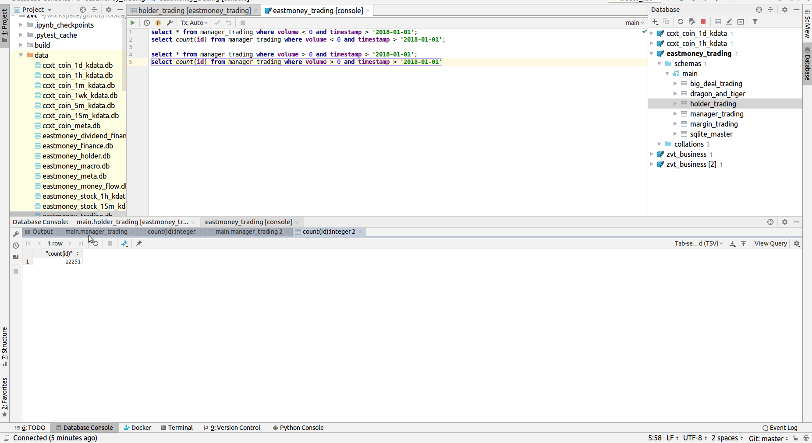

## 目前支持的数据

### 股票数据
|名称|dataschema|provider|comments| download|
|-----------|--------|--------|-----|-----|
|个股资料|Stock|eastmoney,sina|个股和板块为多对多的关系|
|板块资料|Index|eastmoney,sina|板块有行业,概念,区域三个分类的维度,不同的provider分类会有所不同,个股和板块为多对多的关系|
|个股行情|Stock{level}Kdata|joinquant,netease,eastmoney|支持1,5,15,30,60分钟, 日线,周线级别|
|指数日线行情|Index1DKdata|eastmoney,sina,joinquant|指数本质上也是一种板块,指数对应板块资料中的标的|
|个股资金流|MoneyFlow|eastmoney,sina,joinquant||
|板块资金流|MoneyFlow|eastmoney,sina,joinquant|对应板块资料里面的标的|
|分红融资数据|DividendFinancing|eastmoney|企业最后的底线就是能不能给投资者赚钱,此为年度统计信息|
|分红明细|DividendDetail|eastmoney||
|融资明细|SPODetail|eastmoney||
|配股明细|RightsIssueDetail|eastmoney||
|主要财务指标|FinanceFactor|eastmoney||
|资产负债表|BalanceSheet|eastmoney||
|利润表|IncomeStatement|eastmoney||
|现金流量表|CashFlowStatement|eastmoney||
|十大股东|TopTenHolder|eastmoney||
|十大流通股东|TopTenTradableHolder|eastmoney||
|机构持股|InstitutionalInvestorHolder|eastmoney||
|高管交易|ManagerTrading|eastmoney||
|大股东交易|HolderTrading|eastmoney||
|大宗交易|BigDealTrading|eastmoney||
|融资融券|MarginTrading|eastmoney||
|龙虎榜数据|DragonAndTiger|eastmoney||

### 数字货币数据

|名称|dataschema|provider|comments| download|
|-----------|--------|--------|-----|-----|
|货币资料|Coin|ccxt||
|行情|Coin{level}Kdata|ccxt|支持tick,1,5,15,30,60分钟, 日线,周线级别|

### 期货数据
> 待支持


## 使用示例

### 个股K线
```
In [5]: from zvt.api import technical
In [6]: df= technical.get_kdata(security_id='stock_sz_000338',provider='joinquant')
In [7]: df.tail()                                                                                                                                                                        
Out[7]: 
                                    id   provider  timestamp      security_id    code  name level   open  hfq_open   qfq_open  close  hfq_close  qfq_close   high  hfq_high   qfq_high    low  hfq_low    qfq_low       volume      turnover change_pct turnover_rate  factor
timestamp                                                                                                                                                                                                                                                                    
2019-06-25  stock_sz_000338_2019-06-25  joinquant 2019-06-25  stock_sz_000338  000338  潍柴动力    1d  12.55    235.41  12.549845  12.28     230.35  12.280094  12.56    235.60  12.559974  12.08   226.60  12.080179   75627481.0  9.256614e+08       None          None  18.758
2019-06-26  stock_sz_000338_2019-06-26  joinquant 2019-06-26  stock_sz_000338  000338  潍柴动力    1d  12.20    228.85  12.200128  12.25     229.79  12.250240  12.38    232.22  12.379785  12.12   227.35  12.120162   39932435.0  4.891142e+08       None          None  18.758
2019-06-27  stock_sz_000338_2019-06-27  joinquant 2019-06-27  stock_sz_000338  000338  潍柴动力    1d  12.25    229.79  12.250240  12.25     229.79  12.250240  12.25    229.79  12.250240  12.25   229.79  12.250240          0.0  0.000000e+00       None          None  18.758
2019-06-28  stock_sz_000338_2019-06-28  joinquant 2019-06-28  stock_sz_000338  000338  潍柴动力    1d  12.23    229.41  12.229982  12.29     230.54  12.290223  12.44    233.35  12.440026  12.23   229.41  12.229982   43280844.0  5.325563e+08       None          None  18.758
2019-07-01  stock_sz_000338_2019-07-01  joinquant 2019-07-01  stock_sz_000338  000338  潍柴动力    1d  12.50    234.48  12.500267  12.89     241.79  12.889967  12.95    242.92  12.950208  12.41   232.79  12.410172  101787878.0  1.291295e+09       None          None  18.758

```

### 数字货币k线
```
In [10]: df= technical.get_kdata(security_id='coin_binance_EOS/USDT',provider='ccxt')                                                                                                    
In [10]: df.tail()                                                                                                                                                                       
Out[10]: 
                                          id provider  timestamp            security_id      code      name level    open   close    high     low       volume turnover
timestamp                                                                                                                                                              
2019-06-26  coin_binance_EOS/USDT_2019-06-26     ccxt 2019-06-26  coin_binance_EOS/USDT  EOS/USDT  EOS/USDT    1d  7.1736  6.8096  7.4475  6.1000  16934720.29     None
2019-06-27  coin_binance_EOS/USDT_2019-06-27     ccxt 2019-06-27  coin_binance_EOS/USDT  EOS/USDT  EOS/USDT    1d  6.8082  5.9663  6.8557  5.6329  20215677.51     None
2019-06-28  coin_binance_EOS/USDT_2019-06-28     ccxt 2019-06-28  coin_binance_EOS/USDT  EOS/USDT  EOS/USDT    1d  5.9742  6.2182  6.2918  5.7625  12172080.98     None
2019-06-29  coin_binance_EOS/USDT_2019-06-29     ccxt 2019-06-29  coin_binance_EOS/USDT  EOS/USDT  EOS/USDT    1d  6.2206  6.3302  6.3915  5.9566   7403462.75     None
2019-06-30  coin_binance_EOS/USDT_2019-06-30     ccxt 2019-06-30  coin_binance_EOS/USDT  EOS/USDT  EOS/USDT    1d  6.3282  5.7926  6.3966  5.6894   8043978.96     None

```

### 社保持仓
```
In [11]: from zvt.domain import *  
         from zvt.api import fundamental
In [12]: df = fundamental.get_top_ten_tradable_holder(start_timestamp='2018-09-30',filters=[TopTenTradableHolder.holder_name.like('%社保%')],order=TopTenTradableHolder.shareholding_ratio.desc())

In [18]: df.tail()                                                                                                                                                                       
Out[18]: 
                                                         id provider  timestamp      security_id    code         report_period report_date holder_code  holder_name  shareholding_numbers  shareholding_ratio     change  change_ratio
timestamp                                                                                                                                                                                                                             
2019-03-31  stock_sz_000778_2019-03-31 00:00:00_全国社保基金五零三组合     None 2019-03-31  stock_sz_000778  000778  ReportPeriod.season1  2019-03-31    70010503  全国社保基金五零三组合            60000000.0              0.0153  1000000.0        0.0169
2019-03-31  stock_sz_002572_2019-03-31 00:00:00_全国社保基金一零九组合     None 2019-03-31  stock_sz_002572  002572  ReportPeriod.season1  2019-03-31    70010109  全国社保基金一零九组合             7520000.0              0.0118 -8013000.0       -0.5159
2019-03-31  stock_sz_000338_2019-03-31 00:00:00_全国社保基金一零二组合     None 2019-03-31  stock_sz_000338  000338  ReportPeriod.season1  2019-03-31    70010102  全国社保基金一零二组合            44000000.0              0.0071 -6000000.0       -0.1200
2019-03-31  stock_sz_000338_2019-03-31 00:00:00_全国社保基金一零一组合     None 2019-03-31  stock_sz_000338  000338  ReportPeriod.season1  2019-03-31    70010101  全国社保基金一零一组合            36850000.0              0.0060        NaN           NaN
2019-03-31  stock_sz_000778_2019-03-31 00:00:00_全国社保基金四一三组合     None 2019-03-31  stock_sz_000778  000778  ReportPeriod.season1  2019-03-31    70010413  全国社保基金四一三组合            17800000.0              0.0045        NaN           NaN

```

### 马云持仓 ###
```bash
In [26]: df = get_top_ten_tradable_holder(filters=[TopTenTradableHolder.holder_name=='马云'])
Out[27]: 
   holder_name    code  shareholding_numbers  shareholding_ratio      change  change_ratio
0           马云  002204              460800.0              0.0085         NaN           NaN
1           马云  300027             3912000.0              0.0205         NaN           NaN
2           马云  300027             8319000.0              0.0230         NaN           NaN
3           马云  300027             8319000.0              0.0230         NaN           NaN

22          马云  300027            99780000.0              0.0520         NaN           NaN
23          马云  300027            99780000.0              0.0520         NaN           NaN
24          马云  300027            99780000.0              0.0451         NaN           NaN
```
### 2018年报eps前50
```bash
In [30]: df = get_finance_factor(start_timestamp='2018-12-31',order=FinanceFactor.basic_eps.desc(),limit=50,columns=[FinanceFactor.code,FinanceFactor.timestamp,FinanceFactor.basic_eps])
Out[31]: 
      code  timestamp  basic_eps
0   600519 2018-12-31    28.0200
1   603444 2018-12-31    10.1200
2   601318 2018-12-31     6.0200
3   000661 2018-12-31     5.9200

47  603393 2018-12-31     2.0900
48  601869 2018-12-31     2.0900
49  600507 2018-12-31     2.0800

```

更多api和相应的数据，可查看代码:  
[*data schema*](https://github.com/zvtvz/zvt/tree/master/zvt/domain)  
[*data api*](https://github.com/zvtvz/zvt/tree/master/zvt/api)  

filters参数的使用请参考[*sqlalchemy*](https://docs.sqlalchemy.org/en/13/orm/query.html),SQL能做的查询都能做

## SQL查询
你也可以直接使用项目中的sqlite数据库,利用你熟悉的工具,语言来进行研究

比如:查看某段时间整个市场的高管增持减持
```
select * from manager_trading where volume < 0 and timestamp > '2018-01-01';
select count(id) from manager_trading where volume < 0 and timestamp > '2018-01-01';

select * from manager_trading where volume > 0 and timestamp > '2018-01-01';
select count(id) from manager_trading where volume > 0 and timestamp > '2018-01-01'
```
<p align="center"></p>

库都给你了,SQL大神,请开始你的表演