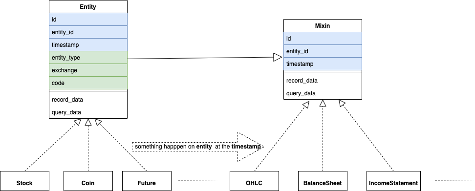

.. _extending_data:

==============
Extend data
==============

Data structure
--------------------------
zvt use sql database(default sqlite, and easy extend to others) to store data
and provide uniform api to record and query data.(Thanks to the great `Sqlalchemy <https://github.com/sqlalchemy/sqlalchemy>`_)

As we know, :ref:`TradableEntity<data.tradable_entity>` and :ref:`ActorEntity<data.actor_entity>` is everything about the market, data is the events happen on them.
The Schema of the data would always in following structure:

It shows how we define the Entity in the market:

* entity_type

tradable entity type, e.g. stock, future, bond and so on.

* exchange

the exchange of entity

* code

the code of the entity

Naturally the id of the entity is defined:

::

    {entity_type}_{exchange}_{code}

And the common fields:

* entity_id

entity id

* timestamp

happen time

* id

the id of the record, most of time, it's:

::

{entity_id}_{timestamp}

Data definition
--------------------------

zvt data is defined by three concepts:

* Database

The rule is one module define one db.

* Schema

The Schema defined in the module belongs to the Database defined inside.

* Provider

The Database could have different providers

Many pre supported data is in `zvt.domain modules <https://github.com/zvtvz/zvt/blob/master/src/zvt/domain>`_,
e.g. `Finance data <https://github.com/zvtvz/zvt/blob/master/src/zvt/domain/fundamental/finance.py>`_, you could
refer them when you want to extend data.

.. _extending_data.add_data:

Key steps to add data
--------------------------

Let's show the key steps to add data.

1. Intent
~~~~~~~~~~~~~~~~~~~~
I want to add some data about the news on Stock.

2. Find data source
~~~~~~~~~~~~~~~~~~~~
The data source could be whatever you can see in the web ——— just write some
web crawlers to get them, e.g, most of `pre-implemented recorders <https://github.com/zvtvz/zvt/tree/master/src/zvt/recorders>`_.
And you could use data from commercial data provider in the same way, e.g. `joinquant recorders <https://github.com/zvtvz/zvt/tree/master/src/zvt/recorders/joinquant>`_.

Let's show the crawler way here:

Open `eastmoney wap <https://wap.eastmoney.com/quote/stock/0.002572.html>`_ and Find `news api <https://np-listapi.eastmoney.com/comm/wap/getListInfo?cb=callback&client=wap&type=1&mTypeAndCode=0.002572&pageSize=20&pageIndex=1&callback=jQuery1830017478247906740352_1644568731256&_=1644568879493>`_

The news item result:

::

    {
      "Art_ShowTime": "2022-02-09 14:12:30",
      "Art_Image": "",
      "Art_MediaName": "每日经济新闻",
      "Art_Code": "202202092271136373",
      "Art_Title": "首创证券维持索菲亚买入评级 公司简评报告：多重因素影响短期压制业绩 看好2022年利润修复",
      "Art_SortStart": "1644387150036373",
      "Art_VideoCount": 0,
      "Art_OriginUrl": "http://finance.eastmoney.com/news/1354,202202092271136373.html",
      "Art_Url": "http://finance.eastmoney.com/a/202202092271136373.html"
    }

3. Define Schema
~~~~~~~~~~~~~~~~~~~~

No matter what the format of the data outside zvt is, we use zvt simple and
uniform contract to define them.

::

    >>> from sqlalchemy import Column, String
    >>> from sqlalchemy.orm import declarative_base
    >>> from zvt.contract import Mixin
    >>> from zvt.contract.register import register_schema
    >>> NewsBase = declarative_base()
    >>> class StockNews(NewsBase, Mixin):
    >>>     __tablename__ = "stock_news"
    >>>     #: news title
    >>>     news_title = Column(String)
    >>>
    >>> register_schema(providers=["em"], db_name="stock_news", schema_base=NewsBase, entity_type="stock")

Check the defined db

::

    >>> StockNews.get_storages()

    [Engine(sqlite:////Users/foolcage/zvt-home/data/em_stock_news.db?check_same_thread=False)]

As you see, the db file name format is:

::

    {provider}_{db_name}

If you have another provider, e.g. sina, just register it too:

::

    >>> register_schema(providers=["em", "sina"], db_name="stock_news", schema_base=NewsBase, entity_type="stock")

And you could find another db file:

::

    >>> StockNews.get_storages()

    [Engine(sqlite:////Users/foolcage/zvt-home/data/sina_stock_news.db?check_same_thread=False)]

The advantage of this mechanism is:

* schema is the way you want
* provider could be switched seamlessly

4. Implement recorder
~~~~~~~~~~~~~~~~~~~~~
Let's implement a recorder for StockNews.

::

    import pandas as pd
    from zvt.contract.api import df_to_db
    from zvt.contract.recorder import FixedCycleDataRecorder
    from zvt.domain import Stock
    from zvt.domain.misc.stock_news import StockNews
    from zvt.recorders.em import em_api

    class EMStockNewsRecorder(FixedCycleDataRecorder):
        original_page_url = "https://wap.eastmoney.com/quote/stock/0.002572.html"
        url = "https://np-listapi.eastmoney.com/comm/wap/getListInfo?cb=callback&client=wap&type=1&mTypeAndCode=0.002572&pageSize=200&pageIndex={}&callback=jQuery1830017478247906740352_1644568731256&_=1644568879493"

        # the entity class you record for
        entity_schema = Stock
        # connect schema with recorder
        data_schema = StockNews
        # entity data provider
        entity_provider = "em"
        # data schema provider
        provider = "em"

        def record(self, entity, start, end, size, timestamps):
            news = em_api.get_news(entity_id=entity.id)
            df = pd.DataFrame.from_records(news)
            self.logger.info(df)
            df_to_db(df=df, data_schema=self.data_schema, provider=self.provider, force_update=self.force_update)

After that, you could use the data in zvt way:

::

    >>> StockNews.record_data(provider="em", entity_id="stock_sz_002572")
    >>> df = StockNews.query_data(entity_id="stock_sz_002572")
    >>> print(df)

                                              id        entity_id           timestamp                                     news_title
    0    stock_sz_002572_2019-05-20 19:50:42  stock_sz_002572 2019-05-20 19:50:42                索菲亚（002572.SZ）：股价回撤超65% 是低吸机会吗?
    1    stock_sz_002572_2019-05-24 22:39:47  stock_sz_002572 2019-05-24 22:39:47                             索菲亚拟发行不超过5亿元超短期融资券
    2    stock_sz_002572_2019-05-24 22:48:54  stock_sz_002572 2019-05-24 22:48:54              索菲亚(002572.SZ)拟终止发行不超10亿元的可转换公司债券
    3    stock_sz_002572_2019-06-04 14:06:42  stock_sz_002572 2019-06-04 14:06:42              索菲亚(002572.SZ)截至5月底已累计回购2.02亿元的股份
    4    stock_sz_002572_2019-06-13 06:24:44  stock_sz_002572 2019-06-13 06:24:44                                索菲亚功臣王飚能否扶起汉森中国
    ..                                   ...              ...                 ...                                            ...
    367  stock_sz_002572_2022-02-07 14:04:40  stock_sz_002572 2022-02-07 14:04:40         开源证券维持索菲亚买入评级 近期获6份券商研报关注 目标均价涨幅59.82%
    368  stock_sz_002572_2022-02-07 15:32:46  stock_sz_002572 2022-02-07 15:32:46                             【调研快报】索菲亚接待机构投资者调研
    369  stock_sz_002572_2022-02-08 16:50:37  stock_sz_002572 2022-02-08 16:50:37                             索菲亚：公司承接了容东片区安置房项目
    370  stock_sz_002572_2022-02-08 21:59:00  stock_sz_002572 2022-02-08 21:59:00       9亿坏账拖累净利下降九成 家具巨头索菲亚“甩包袱”起跑 腰斩的股价能否趁势抬头？
    371  stock_sz_002572_2022-02-09 14:12:30  stock_sz_002572 2022-02-09 14:12:30  首创证券维持索菲亚买入评级 公司简评报告：多重因素影响短期压制业绩 看好2022年利润修复

    [372 rows x 4 columns]

.. _extending_data.tradable_entity:

Add new TradableEntity
--------------------------
It's human nature to like the new and hate the old. Adding new TradableEntity is easy in zvt.

And from a higher perspective, trading is everywhere. you make trading everytime when you make the
decision.

So you could treat Country as TradableEntity and make trading when making decision where to live or invest.

Let's show the key steps to add new TradableEntity.

1. Define entity Schema
~~~~~~~~~~~~~~~~~~~~~~~

::

    # -*- coding: utf-8 -*-

    from sqlalchemy import Column, String, Float
    from sqlalchemy.orm import declarative_base

    from zvt.contract.schema import TradableEntity
    from zvt.contract.register import register_schema, register_entity

    CountryMetaBase = declarative_base()

    @register_entity(entity_type="country")
    class Country(CountryMetaBase, TradableEntity):
        __tablename__ = "country"

        #: 区域
        #: region
        region = Column(String(length=128))
        #: 首都
        #: capital city
        capital_city = Column(String(length=128))
        #: 收入水平
        #: income level
        income_level = Column(String(length=64))
        #: 贷款类型
        #: lending type
        lending_type = Column(String(length=64))
        #: 经度
        #: longitude
        longitude = Column(Float)
        #: 纬度
        #: latitude
        latitude = Column(Float)

    register_schema(providers=["wb"], db_name="country_meta", schema_base=CountryMetaBase)

entity_type, exchange and code define the entity, for country, it's in following way:

::

    entity_type = "country"
    exchange = "galaxy"
    code = "iso code"

e.g. country_galaxy_CN = China, country_galaxy_US = United States of America

2. Implement recorder for the entity
~~~~~~~~~~~~~~~~~~~~~~~~~~~~~~~~~~~~

::

    from zvt.contract.api import df_to_db
    from zvt.contract.recorder import Recorder
    from zvt.domain.meta.country_meta import Country
    from zvt.recorders.wb import wb_api

    class WBCountryRecorder(Recorder):
        provider = "wb"
        data_schema = Country

        def run(self):
            df = wb_api.get_countries()
            df_to_db(df=df, data_schema=self.data_schema, provider=self.provider, force_update=self.force_update)

3. Define schema for the entity
~~~~~~~~~~~~~~~~~~~~~~~~~~~~~~~

e.g treasury yield of the country
::

    # -*- coding: utf-8 -*-
    from sqlalchemy import Column, String, Float
    from sqlalchemy.orm import declarative_base

    from zvt.contract import Mixin
    from zvt.contract.register import register_schema

    CurrencyBase = declarative_base()

    class TreasuryYield(CurrencyBase, Mixin):
        __tablename__ = "treasury_yield"

        code = Column(String(length=32))

        # 2年期
        yield_2 = Column(Float)
        # 5年期
        yield_5 = Column(Float)
        # 10年期
        yield_10 = Column(Float)
        # 30年期
        yield_30 = Column(Float)

    register_schema(providers=["em"], db_name="currency", schema_base=CurrencyBase)

And the `recorder <https://github.com/zvtvz/zvt/blob/master/src/zvt/recorders/em/macro/em_treasury_yield_recorder.py>`_ for the schema

4. Use them in zvt way
~~~~~~~~~~~~~~~~~~~~~~

Find the rich country:

::

    >>> from zvt.domain import Country
    >>> Country.record_data()
    >>> df = Country.query_data()
    >>> df[df['income_level']=='High income']

                       id          entity_id timestamp entity_type exchange code                    name list_date end_date                      region      capital_city income_level    lending_type   longitude   latitude
    0    country_galaxy_AW  country_galaxy_AW      None     country   galaxy   AW                   Aruba      None     None  Latin America & Caribbean         Oranjestad  High income  Not classified  -70.016700  12.516700
    7    country_galaxy_AD  country_galaxy_AD      None     country   galaxy   AD                 Andorra      None     None       Europe & Central Asia  Andorra la Vella  High income  Not classified    1.521800  42.507500
    9    country_galaxy_AE  country_galaxy_AE      None     country   galaxy   AE    United Arab Emirates      None     None  Middle East & North Africa         Abu Dhabi  High income  Not classified   54.370500  24.476400
    13   country_galaxy_AG  country_galaxy_AG      None     country   galaxy   AG     Antigua and Barbuda      None     None  Latin America & Caribbean       Saint John's  High income            IBRD  -61.845600  17.117500
    14   country_galaxy_AU  country_galaxy_AU      None     country   galaxy   AU               Australia      None     None         East Asia & Pacific          Canberra  High income  Not classified  149.129000 -35.282000
    ..                 ...                ...       ...         ...      ...  ...                     ...       ...      ...                         ...               ...          ...             ...         ...        ...
    277  country_galaxy_TW  country_galaxy_TW      None     country   galaxy   TW           Taiwan, China      None     None         East Asia & Pacific                    High income  Not classified         NaN        NaN
    282  country_galaxy_UY  country_galaxy_UY      None     country   galaxy   UY                 Uruguay      None     None  Latin America & Caribbean         Montevideo  High income            IBRD  -56.067500 -34.894100
    283  country_galaxy_US  country_galaxy_US      None     country   galaxy   US           United States      None     None               North America   Washington D.C.  High income  Not classified  -77.032000  38.889500
    287  country_galaxy_VG  country_galaxy_VG      None     country   galaxy   VG  British Virgin Islands      None     None  Latin America & Caribbean          Road Town  High income  Not classified  -64.623056  18.431389
    288  country_galaxy_VI  country_galaxy_VI      None     country   galaxy   VI   Virgin Islands (U.S.)      None     None  Latin America & Caribbean   Charlotte Amalie  High income  Not classified  -64.896300  18.335800

    [80 rows x 15 columns]

Compare treasury yields of different maturities:

::

    >>> from zvt.domain import TreasuryYield
    >>> from zvt.api.intent import compare
    >>> TreasuryYield.record_data()
    >>> compare(codes=["US"], schema=TreasuryYield, columns=["yield_2", "yield_10", "yield_30"])

.. image:: ../_static/compare_yields.png