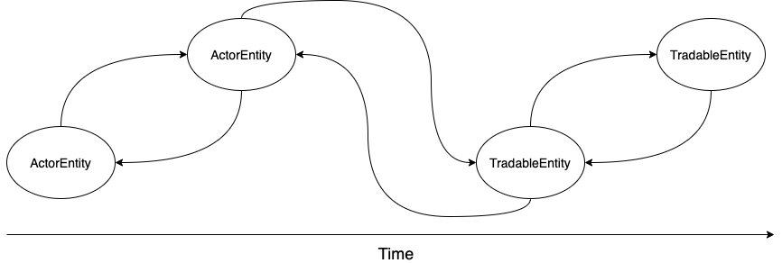

==========
Data
==========

| Without data, quant becomes a castle in the air.
| So, what exactly is data?
| zvt makes a concise and unified abstraction of data:

    In the world of zvt, there are two kinds of entities, one is :ref:`tradable entity <data.tradable_entity>`,
    the other is :ref:`actor entity <data.actor_entity>`. Data is the events happened on them.

.. note::

    Philosophically, entity is the existence described by itself, classification of existential concepts.

.. toctree::
    :maxdepth: 2

    data_concepts
    record_and_query
    extending_data
    adding_new_entity
    trading_anything
