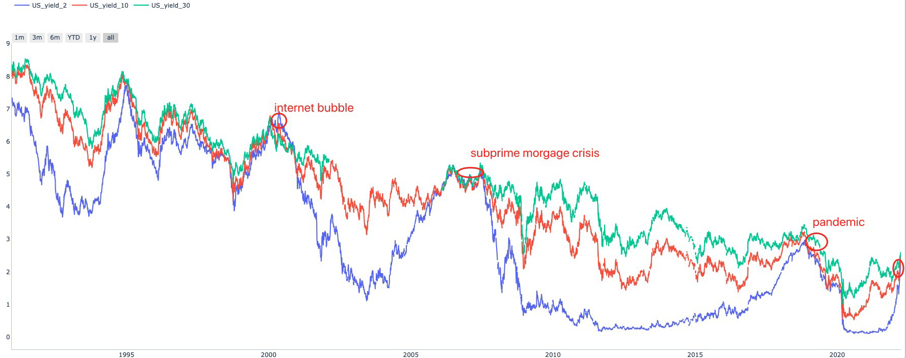

.. trading_anything:

=======================
Capital without country
=======================

From a higher perspective, trading is everywhere. you make trading everytime when you make the
decision.

So you could treat Country as TradableEntity and make trading when making decision where to live or invest.

It's nothing than a specific case of :ref:`Adding new entity <adding_new_entity>`.

Let's show the key steps below.

Define entity Schema
--------------------------

::

    # -*- coding: utf-8 -*-

    from sqlalchemy import Column, String, Float
    from sqlalchemy.orm import declarative_base

    from zvt.contract.schema import TradableEntity
    from zvt.contract.register import register_schema, register_entity

    CountryMetaBase = declarative_base()

    @register_entity(entity_type="country")
    class Country(CountryMetaBase, TradableEntity):
        __tablename__ = "country"

        #: 区域
        #: region
        region = Column(String(length=128))
        #: 首都
        #: capital city
        capital_city = Column(String(length=128))
        #: 收入水平
        #: income level
        income_level = Column(String(length=64))
        #: 贷款类型
        #: lending type
        lending_type = Column(String(length=64))
        #: 经度
        #: longitude
        longitude = Column(Float)
        #: 纬度
        #: latitude
        latitude = Column(Float)

    register_schema(providers=["wb"], db_name="country_meta", schema_base=CountryMetaBase)

entity_type, exchange and code define the entity, for country, it's in following way:

::

    entity_type = "country"
    exchange = "galaxy"
    code = "iso code"

e.g. country_galaxy_CN = China, country_galaxy_US = United States of America

Implement recorder for the entity
---------------------------------

::

    from zvt.contract.api import df_to_db
    from zvt.contract.recorder import Recorder
    from zvt.domain.meta.country_meta import Country
    from zvt.recorders.wb import wb_api

    class WBCountryRecorder(Recorder):
        provider = "wb"
        data_schema = Country

        def run(self):
            df = wb_api.get_countries()
            df_to_db(df=df, data_schema=self.data_schema, provider=self.provider, force_update=self.force_update)

Define schema for the entity
----------------------------

e.g treasury yield of the country
::

    # -*- coding: utf-8 -*-
    from sqlalchemy import Column, String, Float
    from sqlalchemy.orm import declarative_base

    from zvt.contract import Mixin
    from zvt.contract.register import register_schema

    MonetaryBase = declarative_base()

    class TreasuryYield(MonetaryBase, Mixin):
        __tablename__ = "treasury_yield"

        code = Column(String(length=32))

        # 2年期
        yield_2 = Column(Float)
        # 5年期
        yield_5 = Column(Float)
        # 10年期
        yield_10 = Column(Float)
        # 30年期
        yield_30 = Column(Float)

    register_schema(providers=["em"], db_name="monetary", schema_base=MonetaryBase)
    # the __all__ is generated
    __all__ = ["TreasuryYield"]

And the `recorder <https://github.com/zvtvz/zvt/blob/master/src/zvt/recorders/em/macro/em_treasury_yield_recorder.py>`_ for the schema

Use them in zvt way
-------------------

Find the rich country:

::

    >>> from zvt.domain import Country
    >>> Country.record_data()
    >>> df = Country.query_data()
    >>> df[df['income_level']=='High income']

                       id          entity_id timestamp entity_type exchange code                    name list_date end_date                      region      capital_city income_level    lending_type   longitude   latitude
    0    country_galaxy_AW  country_galaxy_AW      None     country   galaxy   AW                   Aruba      None     None  Latin America & Caribbean         Oranjestad  High income  Not classified  -70.016700  12.516700
    7    country_galaxy_AD  country_galaxy_AD      None     country   galaxy   AD                 Andorra      None     None       Europe & Central Asia  Andorra la Vella  High income  Not classified    1.521800  42.507500
    9    country_galaxy_AE  country_galaxy_AE      None     country   galaxy   AE    United Arab Emirates      None     None  Middle East & North Africa         Abu Dhabi  High income  Not classified   54.370500  24.476400
    13   country_galaxy_AG  country_galaxy_AG      None     country   galaxy   AG     Antigua and Barbuda      None     None  Latin America & Caribbean       Saint John's  High income            IBRD  -61.845600  17.117500
    14   country_galaxy_AU  country_galaxy_AU      None     country   galaxy   AU               Australia      None     None         East Asia & Pacific          Canberra  High income  Not classified  149.129000 -35.282000
    ..                 ...                ...       ...         ...      ...  ...                     ...       ...      ...                         ...               ...          ...             ...         ...        ...
    277  country_galaxy_TW  country_galaxy_TW      None     country   galaxy   TW           Taiwan, China      None     None         East Asia & Pacific                    High income  Not classified         NaN        NaN
    282  country_galaxy_UY  country_galaxy_UY      None     country   galaxy   UY                 Uruguay      None     None  Latin America & Caribbean         Montevideo  High income            IBRD  -56.067500 -34.894100
    283  country_galaxy_US  country_galaxy_US      None     country   galaxy   US           United States      None     None               North America   Washington D.C.  High income  Not classified  -77.032000  38.889500
    287  country_galaxy_VG  country_galaxy_VG      None     country   galaxy   VG  British Virgin Islands      None     None  Latin America & Caribbean          Road Town  High income  Not classified  -64.623056  18.431389
    288  country_galaxy_VI  country_galaxy_VI      None     country   galaxy   VI   Virgin Islands (U.S.)      None     None  Latin America & Caribbean   Charlotte Amalie  High income  Not classified  -64.896300  18.335800

    [80 rows x 15 columns]

Compare treasury yields of different maturities:

::

    >>> from zvt.domain import TreasuryYield
    >>> from zvt.api.intent import compare
    >>> TreasuryYield.record_data()
    >>> compare(codes=["US"], schema=TreasuryYield, columns=["yield_2", "yield_10", "yield_30"])

