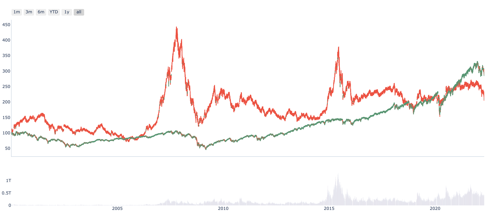

===============
Drawer concepts
===============

Intent
------------------------------
There are many kinds of charts, but the intent is much less. zvt classify
intent as compare, distribute and composite.

We could analyze the entity itself or look at it in the whole market by
comparing with others. :ref:`NormalData<factor.normal_data>` uses
different structure to express different intents.

Compare
------------------------------
Based on zvt's world view and data model, you could compare anything you care about.

Think about that you want to compare S&P 500 index with Shanghai index. It's easy
and comfortable with no pain.

::

    >>> from zvt.api.intent import compare
    >>> from zvt.domain import Indexus1dKdata, Index, Indexus, Index1dKdata
    >>> Index.record_data(provider="em")
    >>> Indexus.record_data(provider="em")
    >>> Index1dKdata.record_data(entity_id="index_sh_000001", provider="em")
    >>> Indexus1dKdata.record_data(entity_id="indexus_us_SPX", provider="em")
    >>> compare(entity_ids=["index_sh_000001", "indexus_us_SPX"], start_timestamp="2000-01-01", scale_value=100)

Try some other style:

::

    >>> compare(entity_ids=["index_sh_000001", "indexus_us_SPX"], start_timestamp="2000-01-01",  schema_map_columns={Index1dKdata:["close"],Indexus1dKdata:["close"]})
