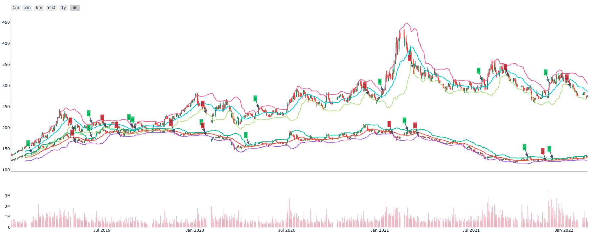
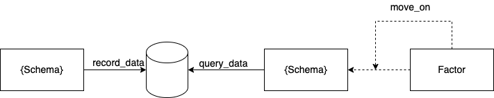

.. _factor.extending_factor:

================
Extending Factor
================

Rethink NormalData
--------------------------
Normal data format is as below:

.. image:: ../_static/normal_data.png

| Why use this format?
| The reason is that human is comfortable for two-dimensional space and
  high-dimensional space could be reduced to it.

Obviously, It's complete and consistent. You could **calculate oneself in time intervals**
or **calculate with others in specific time or intervals**. And it's easy to analyze  the
data with charts by Intent.

Factor data structure
--------------------------
The factor computing flow is as below:

.. image:: ../_static/factor_flow.png

* data_df

NormalData df read from the schema.

* factor_df

NormalData df computed by data_df using use :class:`~.zvt.contract.factor.Transformer`, :class:`~.zvt.contract.factor.Accumulator`
or your custom logic.

* result_df

NormalData df containing columns **filter_result** and(or) **score_result**
which calculated using factor_df or(and) data_df.
Filter_result is True or False, score_result is from 0 to 1.
You could use TargetSelector to select targets at specific time when
filter_result is True and(or) score_result >=0.8 by default or do more
precise control by setting other arguments.

Let's take BullFactor to illustrate the calculation process:
::

    >>> from zvt.factors.macd import BullFactor
    >>> from zvt.domain import Stock1dHfqKdata
    >>> entity_ids = ["stock_sh_601318", "stock_sz_000338"]
    >>> Stock1dHfqKdata.record_data(entity_ids=entity_ids, provider="em")
    >>> factor = BullFactor(entity_ids=entity_ids, provider="em", start_timestamp='2019-01-01', end_timestamp='2019-06-10')

check the dfs:
::

    >>> factor.data_df
    >>> factor.factor_df
    >>> factor.result_df

.. _factor.write_transformer:

Write transformer
--------------------------
Transformer works as bellow:

.. image:: ../_static/transformer.png

What's in your mind is the NormalData format, and then practice the skills to
manipulate it.

You could use other ta lib with it easily, e.g Bollinger Bands using `TA lib <https://github.com/bukosabino/ta#>`_

install ta at first:
::

    pip install --upgrade ta

write boll transformer and factor:
::

    from typing import Optional, List

    import pandas as pd
    from ta.volatility import BollingerBands

    from zvt.contract.factor import *
    from zvt.factors import TechnicalFactor

    class BollTransformer(Transformer):
        def transform_one(self, entity_id, df: pd.DataFrame) -> pd.DataFrame:
            indicator_bb = BollingerBands(close=df["close"], window=20, window_dev=2)

            # Add Bollinger Bands features
            df["bb_bbm"] = indicator_bb.bollinger_mavg()
            df["bb_bbh"] = indicator_bb.bollinger_hband()
            df["bb_bbl"] = indicator_bb.bollinger_lband()

            # Add Bollinger Band high indicator
            df["bb_bbhi"] = indicator_bb.bollinger_hband_indicator()

            # Add Bollinger Band low indicator
            df["bb_bbli"] = indicator_bb.bollinger_lband_indicator()

            # Add Width Size Bollinger Bands
            df["bb_bbw"] = indicator_bb.bollinger_wband()

            # Add Percentage Bollinger Bands
            df["bb_bbp"] = indicator_bb.bollinger_pband()
            return df

    class BollFactor(TechnicalFactor):
        transformer = BollTransformer()

        def drawer_factor_df_list(self) -> Optional[List[pd.DataFrame]]:
            # set the factor to show
            return [self.factor_df[["bb_bbm", "bb_bbh", "bb_bbl"]]]

        def compute_result(self):
            # set filter_result, which bb_bbli=1.0 buy and bb_bbhi=1.0 sell
            super().compute_result()
            self.result_df = (self.factor_df["bb_bbli"] - self.factor_df["bb_bbhi"]).to_frame(name="filter_result")
            self.result_df[self.result_df == 0] = None
            self.result_df[self.result_df == 1] = True
            self.result_df[self.result_df == -1] = False

Let's show it:
::

    >>> from zvt.domain import Stock1dHfqKdata

    >>> provider = "em"
    >>> entity_ids = ["stock_sz_000338", "stock_sh_601318"]
    >>> Stock1dHfqKdata.record_data(entity_ids=entity_ids, provider=provider,)
    >>> factor = BollFactor(
    >>> entity_ids=entity_ids, provider=provider, entity_provider=provider, start_timestamp="2019-01-01"
    >>> )
    >>> factor.draw(show=True)

Most of ta lib support calculate single target by default, so we implement
transform_one of the Transformer. If you want to calculate many targets at
the same time you could implement transform directly and it would be faster.

And Transformer is stateless, so it's easy to reuse in different factor if need.

Factor with IntervalLevel
--------------------------
After you write the transformer and construct the factor, it's easy to use in
different levels.

Let's use BollFactor in IntervalLevel 30m:
::

    >>> from zvt.domain import Stock30mHfqKdata

    >>> provider = "em"
    >>> entity_ids = ["stock_sz_000338", "stock_sh_601318"]

    >>> Stock30mHfqKdata.record_data(entity_ids=entity_ids, provider=provider)
    >>> factor = BollFactor(
            entity_ids=entity_ids, provider=provider, entity_provider=provider, start_timestamp="2021-01-01"
        )
    >>> factor.draw(show=True)

Stream computing
--------------------------
The data is coming continuously and the factor using the data need computing
continuously too.

It's simple and straightforward:

* {Schema}.record_data in one process
* {Factor}.move_on which call {Schema}.query_data in another process

We keep the simple enough philosophy: single process and thread. Enjoy
programming and make everything clear.

Factor persistence
--------------------------
Getting data and computing factor continuously is cool.
But...If It took a long time to calculate the factor and crashed.How would you feel?

Select the targets
--------------------------
You could select the targets according result_df of the factor by yourself.
Or use TargetSelector do it for you.

.. image:: ../_static/factor_result.png

Write accumulator
--------------------------

.. image:: ../_static/accumulator.png
