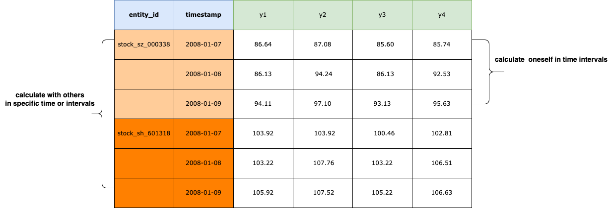
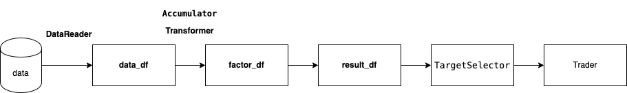
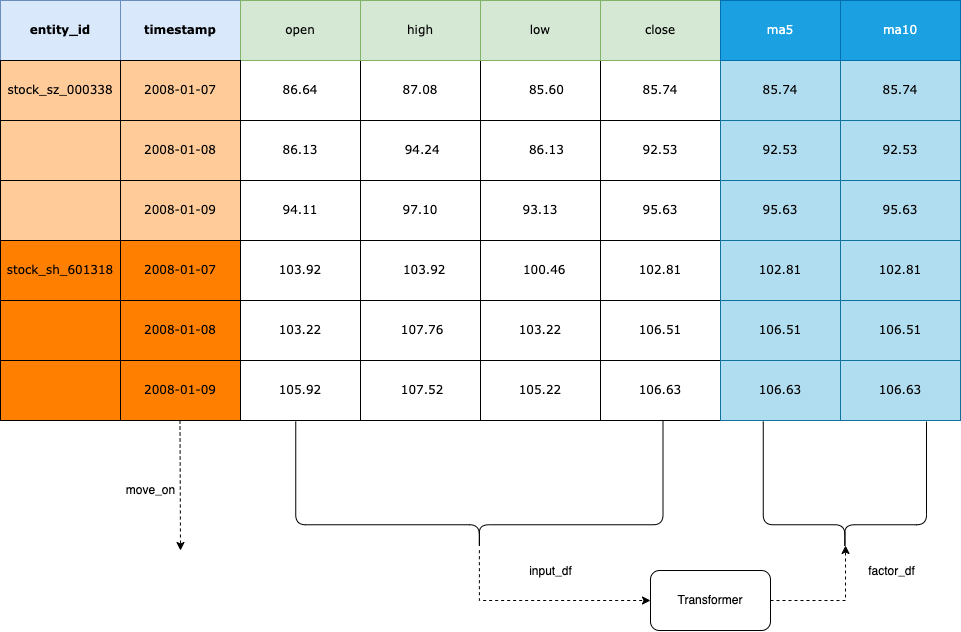
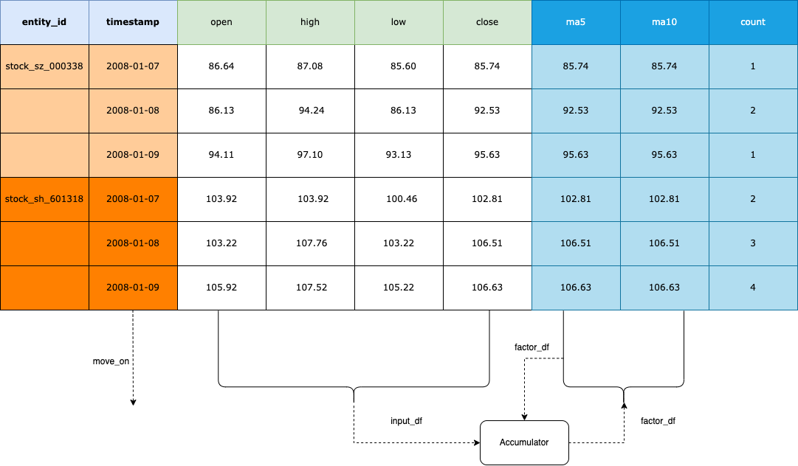
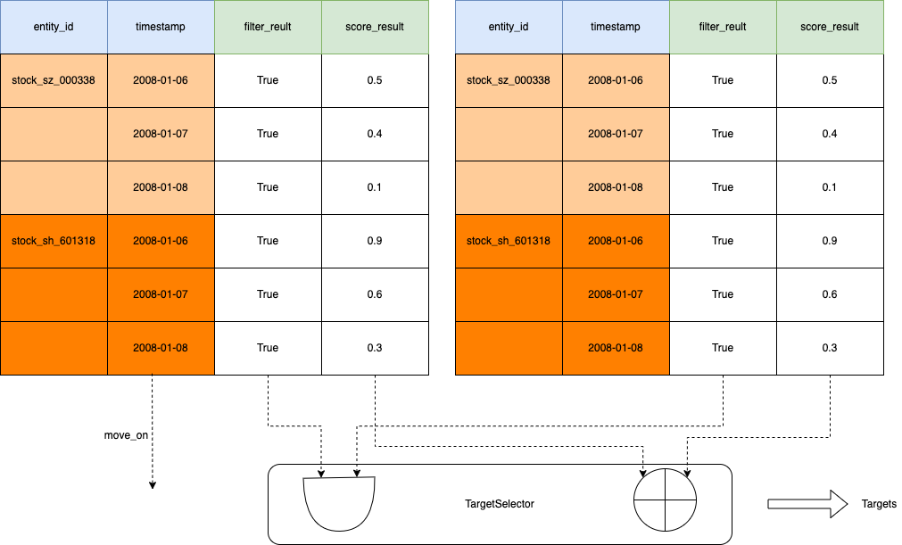

.. _factor.extending_factor:

================
Extending Factor
================

Rethink NormalData
--------------------------
Normal data format is as below:

| Why use this format?
| The reason is that human is comfortable for two-dimensional space and
  high-dimensional space could be reduced to it.

Obviously, It's complete and consistent. You could **calculate oneself in time intervals**
or **calculate with others in specific time or intervals**. And it's easy to analyze  the
data with charts by Intent.

Factor data structure
--------------------------
The factor computing flow is as below:

* data_df

NormalData df read from the schema.

* factor_df

NormalData df computed by data_df using use :class:`~.zvt.contract.factor.Transformer`, :class:`~.zvt.contract.factor.Accumulator`
or your custom logic.

* result_df

NormalData df containing columns **filter_result** and(or) **score_result**
which calculated using factor_df or(and) data_df.
Filter_result is True or False, score_result is from 0 to 1.
You could use TargetSelector to select targets at specific time when
filter_result is True and(or) score_result >=0.8 by default or do more
precise control by setting other arguments.

Let's take an the implemented BullFactor to illustrate the calculation process:
::

    >>> from zvt.factors.macd import BullFactor
    >>> from zvt.domain import Stock1dHfqKdata
    >>> entity_ids = ["stock_sh_601318", "stock_sz_000338"]
    >>> Stock1dHfqKdata.record_data(entity_ids=entity_ids, provider="em")
    >>> factor = BullFactor(entity_ids=entity_ids, provider="em", start_timestamp='2019-01-01', end_timestamp='2019-06-10')

check the dfs:
::

    >>> factor.data_df
    >>> factor.factor_df
    >>> factor.result_df

Write transformer
--------------------------

Write accumulator
--------------------------

Select the targets
--------------------------

