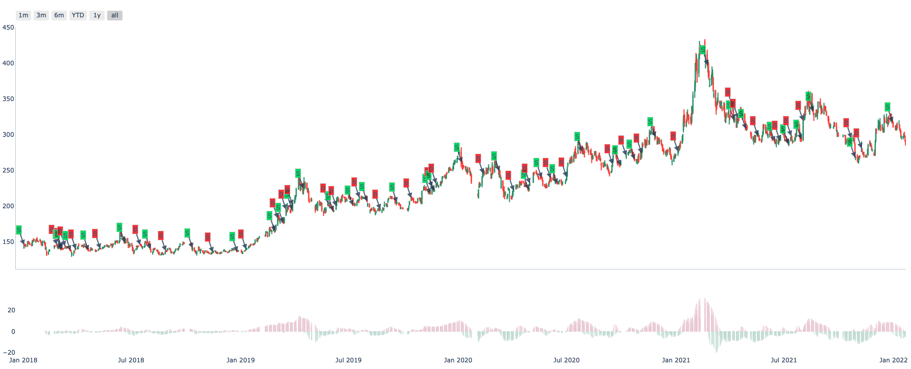

.. _factor.factor_concepts:

===============
Factor concepts
===============

.. _factor.normal_data:

Normal data
------------------------------
:class:`~.zvt.contract.normal_data.NormalData` is the data containing pandas dataframe
with multiple index which level 0 named entity_id and level 1 named timestamp:

===============                 ==========        =====   =====   =====   =====
entity_id                       timestamp         col1    col2    col3    col4
===============                 ==========        =====   =====   =====   =====
stock_sz_000338                 2020-05-05        1.2     0.5     0.3     a
...                             2020-05-06        1.0     0.7     0.2     b
stock_sz_000778                 2020-05-05        1.2     0.5     0.3     a
...                             2020-05-06        1.0     0.7     0.2     b
===============                 ==========        =====   =====   =====   =====

This data structure is used heavily in zvt computing, you should be familiar with it.
`Pandas multiple index guide <https://pandas.pydata.org/pandas-docs/stable/user_guide/advanced.html#>`_ is
a good start.

Query data returning normal data in this way:

::

    {Schema}.query_data(index=["entity_id, timestamp"])

e.g.

::

    >>> from zvt.domain import *
    >>> entity_ids = ["stock_sz_000338", "stock_sz_000001"]
    >>> Stock1dHfqKdata.record_data(entity_ids=entity_ids, provider="em")
    >>> df = Stock1dHfqKdata.query_data(entity_ids=entity_ids, provider="em", index=["entity_id", "timestamp"])
    >>> print(df)

                                                        id        entity_id  timestamp provider    code  name level    open   close    high     low    volume      turnover  change_pct  turnover_rate
    entity_id       timestamp
    stock_sz_000001 1991-04-03  stock_sz_000001_1991-04-03  stock_sz_000001 1991-04-03       em  000001  平安银行    1d   49.00   49.00   49.00   49.00       1.0  5.000000e+03      0.2250         0.0000
                    1991-04-04  stock_sz_000001_1991-04-04  stock_sz_000001 1991-04-04       em  000001  平安银行    1d   48.76   48.76   48.76   48.76       3.0  1.500000e+04     -0.0049         0.0000
                    1991-04-05  stock_sz_000001_1991-04-05  stock_sz_000001 1991-04-05       em  000001  平安银行    1d   48.52   48.52   48.52   48.52       2.0  1.000000e+04     -0.0049         0.0000
                    1991-04-06  stock_sz_000001_1991-04-06  stock_sz_000001 1991-04-06       em  000001  平安银行    1d   48.28   48.28   48.28   48.28       7.0  3.400000e+04     -0.0049         0.0000
                    1991-04-08  stock_sz_000001_1991-04-08  stock_sz_000001 1991-04-08       em  000001  平安银行    1d   48.04   48.04   48.04   48.04       2.0  1.000000e+04     -0.0050         0.0000
    ...                                                ...              ...        ...      ...     ...   ...   ...     ...     ...     ...     ...       ...           ...         ...            ...
    stock_sz_000338 2022-01-17  stock_sz_000338_2022-01-17  stock_sz_000338 2022-01-17       em  000338  潍柴动力    1d  296.26  297.64  298.71  293.49  504866.0  8.546921e+08      0.0026         0.0100
                    2022-01-18  stock_sz_000338_2022-01-18  stock_sz_000338 2022-01-18       em  000338  潍柴动力    1d  298.10  300.87  302.71  296.10  622455.0  1.064735e+09      0.0109         0.0124
                    2022-01-19  stock_sz_000338_2022-01-19  stock_sz_000338 2022-01-19       em  000338  潍柴动力    1d  299.64  299.48  304.24  298.56  610096.0  1.049195e+09     -0.0046         0.0121
                    2022-01-20  stock_sz_000338_2022-01-20  stock_sz_000338 2022-01-20       em  000338  潍柴动力    1d  298.10  294.87  299.18  290.11  812949.0  1.361764e+09     -0.0154         0.0161
                    2022-01-21  stock_sz_000338_2022-01-21  stock_sz_000338 2022-01-21       em  000338  潍柴动力    1d  292.72  287.04  293.34  284.58  754156.0  1.234360e+09     -0.0266         0.0150

    [10878 rows x 15 columns]

.. _factor.factor:

Factor
------------------------------
:class:`~.zvt.contract.factor.Factor` is a computing facility to build *factor* according your mind ——— algorithm.
It reads data from schema, use :class:`~.zvt.contract.factor.Transformer`, :class:`~.zvt.contract.factor.Accumulator`
or your custom logic to compute, and save the result to new schema if need.
It also provides a standard way to evaluate the targets which could be used by :class:`~.zvt.factors.target_selector.TargetSelector`
and :class:`~.zvt.trader.trader.Trader` for backtesting or real trading.

Transformer
------------------------------
Computing factor which depends on input data only.
Here is an example: :class:`~.zvt.factors.algorithm.MaTransformer`

Accumulator
------------------------------
Computing factor which depends on input data and previous result of the factor.
Here is an example: :class:`~.zvt.factors.ma.ma_stats_factor.MaStatsAccumulator.`

Let's have a look by example:

::

    >>> from zvt.factors import GoldCrossFactor
    >>> from zvt.domain import Stock1dHfqKdata
    >>> entity_ids = ["stock_sz_000338"]
    >>> Stock1dHfqKdata.record_data(entity_ids=entity_ids, provider="em")
    >>> factor = GoldCrossFactor(entity_ids=entity_ids, provider="em", start_timestamp="2018-01-01")
    >>> print(factor.factor_df)
    >>> print(factor.result_df)
    >>> factor.draw(show=True)
                               level      turnover    high                          id    open     low        entity_id  timestamp   close  turnover_rate     volume      diff       dea      macd  live   bull  live_count
    entity_id       timestamp
    stock_sz_000338 2018-01-02    1d  8.325588e+08  145.97  stock_sz_000338_2018-01-02  141.21  141.06  stock_sz_000338 2018-01-02  145.67         0.0225   972471.0       NaN       NaN       NaN    -1  False          -1
                    2018-01-03    1d  7.530370e+08  147.66  stock_sz_000338_2018-01-03  146.13  144.29  stock_sz_000338 2018-01-03  144.44         0.0202   870225.0       NaN       NaN       NaN    -1  False          -2
                    2018-01-04    1d  4.917067e+08  145.51  stock_sz_000338_2018-01-04  144.75  143.67  stock_sz_000338 2018-01-04  145.21         0.0133   574335.0       NaN       NaN       NaN    -1  False          -3
                    2018-01-05    1d  5.282211e+08  146.59  stock_sz_000338_2018-01-05  146.44  143.21  stock_sz_000338 2018-01-05  143.21         0.0143   616244.0       NaN       NaN       NaN    -1  False          -4
                    2018-01-08    1d  1.255871e+09  150.43  stock_sz_000338_2018-01-08  143.82  143.82  stock_sz_000338 2018-01-08  150.12         0.0331  1426567.0       NaN       NaN       NaN    -1  False          -5
    ...                          ...           ...     ...                         ...     ...     ...              ...        ...     ...            ...        ...       ...       ...       ...   ...    ...         ...
                    2022-01-17    1d  8.546921e+08  298.71  stock_sz_000338_2022-01-17  296.26  293.49  stock_sz_000338 2022-01-17  297.64         0.0100   504866.0 -1.386687  1.781615 -6.336603    -1  False         -12
                    2022-01-18    1d  1.064735e+09  302.71  stock_sz_000338_2022-01-18  298.10  296.10  stock_sz_000338 2022-01-18  300.87         0.0124   622455.0 -1.694421  1.086407 -5.561657    -1  False         -13
                    2022-01-19    1d  1.049195e+09  304.24  stock_sz_000338_2022-01-19  299.64  298.56  stock_sz_000338 2022-01-19  299.48         0.0121   610096.0 -2.027097  0.463707 -4.981607    -1  False         -14
                    2022-01-20    1d  1.361764e+09  299.18  stock_sz_000338_2022-01-20  298.10  290.11  stock_sz_000338 2022-01-20  294.87         0.0161   812949.0 -2.632389 -0.155513 -4.953753    -1  False         -15
                    2022-01-21    1d  1.234360e+09  293.34  stock_sz_000338_2022-01-21  292.72  284.58  stock_sz_000338 2022-01-21  287.04         0.0150   754156.0 -3.701237 -0.864657 -5.673159    -1  False         -16

    [987 rows x 17 columns]
                                filter_result
    entity_id       timestamp
    stock_sz_000338 2018-01-02          False
                    2018-01-03          False
                    2018-01-04          False
                    2018-01-05          False
                    2018-01-08          False
    ...                                   ...
                    2022-01-17          False
                    2022-01-18          False
                    2022-01-19          False
                    2022-01-20          False
                    2022-01-21          False

    [987 rows x 1 columns]

Follow :ref:`Extending factor <factor.extending_factor>` to do the funny part.

TargetSelector
------------------------------
The class select targets according to Factors.
You could calculate factors in the whole market and use selector to choose the targets.

::

    from zvt.contract import IntervalLevel
    from zvt.factors.target_selector import TargetSelector
    from zvt.factors.ma.ma_factor import CrossMaFactor

    entity_ids = ["stock_sz_000338"]
    entity_type = "stock"
    start_timestamp = "2018-01-01"
    end_timestamp = "2019-06-30"
    my_selector = TargetSelector(
        entity_ids=entity_ids, entity_schema=entity_type, start_timestamp=start_timestamp, end_timestamp=end_timestamp
    )
    # add the factors
    my_selector.add_factor(
        CrossMaFactor(
            entity_provider="em",
            provider="em",
            entity_ids=entity_ids,
            start_timestamp=start_timestamp,
            end_timestamp=end_timestamp,
            computing_window=10,
            windows=[5, 10],
            need_persist=False,
            level=IntervalLevel.LEVEL_1DAY,
            adjust_type="hfq",
        )
    )
    my_selector.run()
    print(my_selector.open_long_df)
    print(my_selector.open_short_df)
    my_selector.get_open_long_targets("2019-06-27")

If not set entity_ids arguments, the selected targets would be in whole market.
And it provides get_open_long_targets function to select targets on the timestamp.
For multiple targets backtesting, this pre computed factor would be very fast.