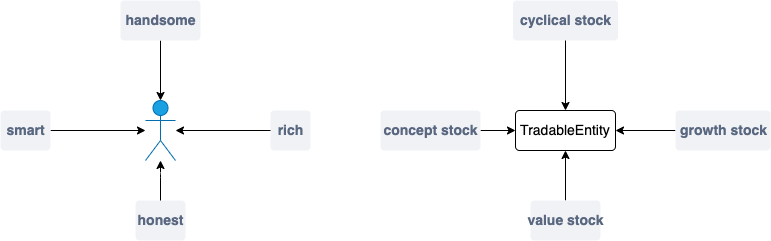

====================
Machine learning
====================

| In today's world, you're not fashion without machine learning.
| So, what could zvt do with ML?
| Being a fashion-feeling person, zvt love ML in this way:

    zvt provide a simple facility to define X and y.
    you could adapt any sophisticated ML library to zvt.

Tagger
------------------------------
:class:`~.zvt.tag.tag.Tagger` is a computing facility for classifying
TradableEntity by different dimensions as tag which could be used as
ml category feature.

People are divided into groups, things are grouped together.

The most important part for trading is which category is suitable to trade
now. ML could help you find which category perform better in different cases
——— deterministic factor.

The tag could be **priori** or calculated from characteristics of the entity ——— some factor.

MLMachine
------------------------------
the ml engine.
